# Huygens Neural Field (HNF)

A physics-inspired neural field built on the Huygens principle. A learnable
complex kernel models wave-like interactions; the same research pattern—
**model → interpretability / probing → physics discovery → domain transfer**—
is developed first on seismology (STEAD picking + Physics Decoder), then
extended to EEG and sparse fluid flow.

```
I. Model                kernel, architecture, STEAD picking, Physics Decoder
II. Interpretability    parameter proofs + physical-neuron probing
III. Physics discovery  knowledge mining, geography, reparameterization
IV. Generalization      Domains II (EEG) / III (fluid rheology)
```

| Stage | Artifact | Result |
|-------|----------|--------|
| Picking (primary) | `outputs/run28/28_ms_fresnel_phys_20ep/best.pt` | det **0.998** / P **0.980** / S **0.965** (~192k; 50ep weights) |
| Picking (legacy) | `outputs/run20/20_wrongpeak_sharp/best.pt` | det 0.994 / P 0.959 / S 0.949 (~139k) |
| Decoder (preferred) | `outputs/physics_decoder_run28_macro/best_physics_head.pt` | val VpRMSE **0.136**; A2 n=256 **init** 0.173 (vs perturb 0.146; init-win 41%) |
| Decoder (ks variant) | `outputs/physics_decoder_run28_macro_ks/` | +kernel_summary + mid-TT; A2 wave-win 56% (still soft) |
| Legacy Decoder | `outputs/zhizi_inversion_bridge_macro/` | run20-macro A2 **wave-win 91%** (init weak 0.304) |

Figures: [`docs/figures/`](docs/figures/). Outputs index: [`outputs/CURRENT.md`](outputs/CURRENT.md).
Inversion notes: [`README_ZHIZI_INVERSION.md`](README_ZHIZI_INVERSION.md).
Plan: [`docs/EXPERIMENT_PLAN.md`](docs/EXPERIMENT_PLAN.md) —
**next = Step 4 OBS multi-chunk** → mining/reparam → EEG → fluid.

> **Parts I–III use seismology as the running example.** Part IV reuses the
> same four-step pattern on other sparse-observation domains.
>
> **Decoder claim (current):** run28 macro is a stronger **FWI-lite initializer**
> than run20-macro (large-N init). Do **not** advertise 90%+ Route A2 wave-win
> for the run28 stack; that remains a run20-macro specialty.

---

# I. Model

Setup, design, structure, and the seismic training / evaluation stack.

## I.1 Setup

```bash
cd HNF
pip install -r requirements.txt
```

- Python deps: `torch>=2.0`, `numpy`, `matplotlib`, `pytest`, `tqdm`, `openpyxl`
- Place STEAD under `STEAD/` (~90GB; gitignored)
- Large run products stay in `outputs/` (gitignored); key plots mirror to `docs/figures/`
- GPU ≥12GB recommended; picking uses `seq_len=800`; bridge inference often uses `infer_seq_len=600`

```bash
python -c "from hnf import HuygensKernel, HuygensNeuralField, STEADHNFPickingModel; print('ok')"
pytest hnf/tests -q
```

## I.2 Model design

Huygens kernel (`hnf/kernel.py`):

\[
K_{\text{Huygens}}(x_i,x_j)=\frac{1}{r^2+\varepsilon}\exp(-\gamma r^2)\exp(i\,\omega r)
\]

**Huygens–Fresnel** variant (`--principle huygens_fresnel`): spherical \(1/r\)
amplitude, extra \(i\omega/(2\pi)\) phase, and obliquity
\(\chi(\theta)=\tfrac12(1+\cos\theta)\) suppressing off-axis secondary sources.
Selected via `--principle` on the picking trainer; default remains `huygens`.

| Piece | Role |
|-------|------|
| Complex phase `exp(i ω r)` | Interference / travel-time structure |
| Gaussian envelope `exp(-γ r²)` | Local secondary-source weight |
| Causality + wave speed | Directed temporal propagation |
| Learnable γ, ω, wave_speed | Soft physical adaptation |
| Distance modes: feature / time / hybrid | Field coordinates or waveform time |

Supporting modules:

- **`DensityNet`** (`density.py`) — spatial / temporal density ρ, Softplus-positive
- **`HuygensWaveLayer` / `HuygensAttention`** (`layers.py`) — stack the kernel in deep models
- **`FastMultipoleMethod`** (`fmm.py`) — far-field acceleration
- **`DeepHuygensKernel`**, **`BayesianHNF`** — deeper / uncertainty variants

In the picking model, **ρ(t)** and kernel wave-speed are **soft conditioners**,
not literal crustal density or absolute velocity. Physical `vp/vs` comes from
the Physics Decoder + optional waveform refine.

## I.3 Model structure

### Field reconstruction

`HuygensNeuralField` solves kernel regression from sparse observations:

```
(x_obs, y) → K_obs = Re(K(obs,obs))
         → w = (K_obs + αI)^{-1} y
         → field = Re(K(target,obs)) @ w
```

```bash
python tools/example_2d_reconstruction.py
python tools/example_2d_reconstruction.py --field-type vortex --n-obs 200 --train-steps 300
```

Helpers: `hnf/visualize.py`, `hnf/demos.py`.

### STEAD classification → phase picking

```bash
python tools/train_stead.py --device cuda
```

Picking model (`STEADHNFPickingModel`): three-component secondary sources →
temporal `rho(t)` → Huygens wave blocks (optional noise-cancel) → det / P / S
heads.

Trainer: `tools/train_stead_picking.py`. Historical launches live under
`scripts/experiments/` (`run11`…`run27`; legacy freeze =
`scripts/experiments/run20_stead_picking.py`). Current primary:
`scripts/experiments/run28_stead_ms_fresnel_phys.py`.

Design choices in **run28** (multi-scale + Huygens–Fresnel + weak phys regs):

- Preserve full temporal resolution and stable detection, then push P/S
- Denoise branch primarily for **det**; P/S use **raw** waveform plus denoise cues
- Wrong-peak / P-before-S / noise-cancel cues carried from the run20 recipe
- From-scratch long cosine schedule (**50 epochs**; local 20ep pilot was strong
  but inferior)

**Primary checkpoint** (50ep weights on this box)

```text
outputs/run28/28_ms_fresnel_phys_20ep/best.pt
  (= outputs/run28/28_ms_fresnel_phys_50ep/best.pt via symlink)
  det_f1 ≈ 0.998   p_f1 ≈ 0.980   s_f1 ≈ 0.965   n_params ≈ 191724
```

```bash
python tools/eval_stead_picking.py --checkpoint outputs/run28/28_ms_fresnel_phys_20ep/best.pt
python tools/explain_stead_picking.py --checkpoint outputs/run28/28_ms_fresnel_phys_20ep/best.pt
```

Dataset: `hnf/stead_picking_dataset.py` (includes geometry fields for later mining).

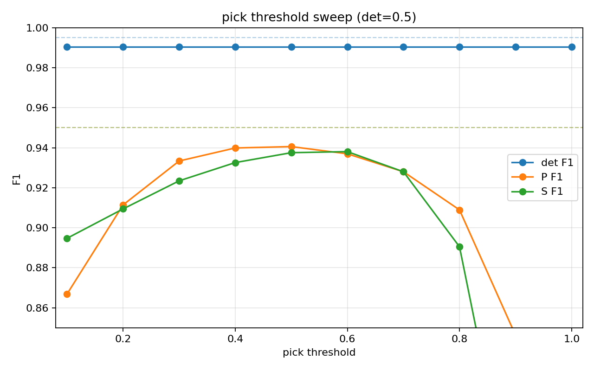

*Figure: historical threshold sweep (run20-era figure; re-sweep on run28 optional).*

### 1D inversion baselines

| Component | Module |
|-----------|--------|
| Layered Earth + P/S travel times | `hnf/inversion_1d.py` |
| Gauss–Newton / L-BFGS / Adam | `hnf/inversion_baselines.py` |
| Acoustic FWI-lite | `hnf/acoustic_fwi_1d.py` |
| Synthetic waveforms | `hnf/synth_waveforms_1d.py` |
| Ray paths | `hnf/ray_paths.py` |

```bash
python scripts/inversion/run_inv01_synth_1d.py
python scripts/inversion/run_inv_full_compare.py
python scripts/inversion/run_inv_fwi_lite.py
```

**Takeaway:** classical TT solvers reach the lowest absolute Vp RMSE on
synthetic oracles. The Zhizi line targets a **better waveform-inversion
initializer**.

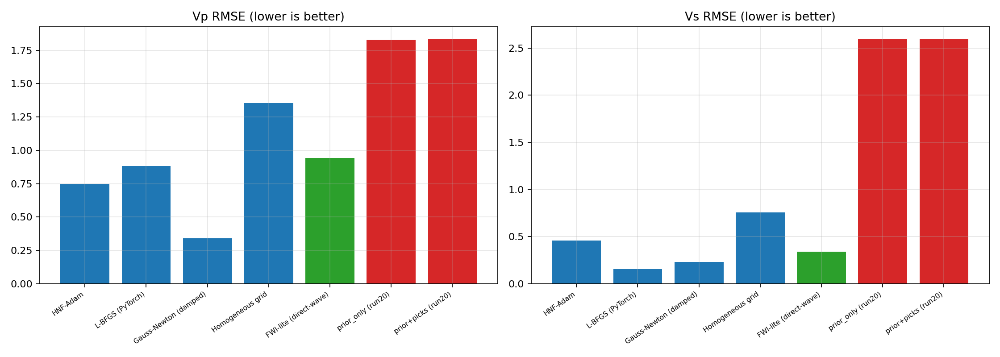

### Physics Decoder

```
Frozen run28 picking backbone
  → rho(t), envelope, kernel soft scales, P/S picks [, kernel_summary γ/ω/c]
  → macro Physics Head: scale / contrast / Vs ratio
  → vp0/vs0 relative to a reference layered model
  → optional waveform refine (Route A2) or travel-time refine
```

Code: `hnf/physics_decoder.py`, `zhizi_physics_head.py`,
`zhizi_inversion_dataset.py`, `zhizi_inversion_loss.py`
(shim: `zhizi_inversion_bridge.py`).

```bash
# Preferred run28 macro (init-focused claim)
python tools/train_zhizi_inversion.py \
  --checkpoint outputs/run28/28_ms_fresnel_phys_20ep/best.pt \
  --head-mode macro --epochs 8 --n-train 96 --n-val 16 \
  --unrolled-weight 0.5 --unrolled-steps 5 \
  --vp-sup-weight 0.05 --lr 3e-3 \
  --output-dir outputs/physics_decoder_run28_macro

# Optional: kernel_summary + weak mid-TT
python tools/train_zhizi_inversion.py ... --kernel-summary --mid-tt-weight 0.08 \
  --output-dir outputs/physics_decoder_run28_macro_ks
```

**Large-N Route A2 (n=256, preferred metric = init):**

| Head | init VpRMSE (Z) | init-win vs perturb | wave-win |
|------|----------------:|--------------------:|---------:|
| **run28 macro** | **0.173** | **40.6%** | 52.7% |
| run28 + ks | 0.186 | 37.5% | 56.3% |
| run20 macro (legacy) | 0.304 | 3.1% | **91.4%** |
| perturb baseline | 0.146 | — | — |

Reports: `outputs/route_a2_run28_macro_n256/`, `route_a2_run20_macro_n256/`,
`route_a2_run28_macro_ks_n256/`.

### Proof suite (large-N)

```bash
python scripts/inversion/run_proof_suite.py --device cuda --max-events 500 --n-synth 128 \
  --checkpoint outputs/run28/28_ms_fresnel_phys_20ep/best.pt \
  --physics-head outputs/physics_decoder_run28_macro/best_physics_head.pt \
  --head-mode macro --output-dir outputs/proof_suite_run28_n500
```

STEAD geom refine (**n=500**): win-rate **69.6%** (PASS vs 65% gate).
Synth wave Z>P: **68%** (n=128). Full JSON: `outputs/proof_suite_run28_n500/proof_report.json`.

### Imaging: synthetic closed loop → real-data profile

```bash
python scripts/inversion/run_phase_e_synth_imaging.py --device cuda --output-dir outputs/phase_e_formal
python scripts/inversion/run_phase_f_stead_profile.py --device cuda --output-dir outputs/phase_f_qc
python scripts/inversion/run_phase_ef_overview.py \
  --phase-e-report outputs/phase_e_formal/report.json \
  --phase-f-report outputs/phase_f_qc/report.json \
  --output-dir outputs/phase_ef_overview
```

| Phase | Highlight |
|-------|-----------|
| E (synth) | marmousi-style mean Vp RMSE **0.851**, coverage / uncertainty maps |
| F (STEAD) | 57/72 QC-kept events; trusted-bin fraction **59.1%** with trust mask |

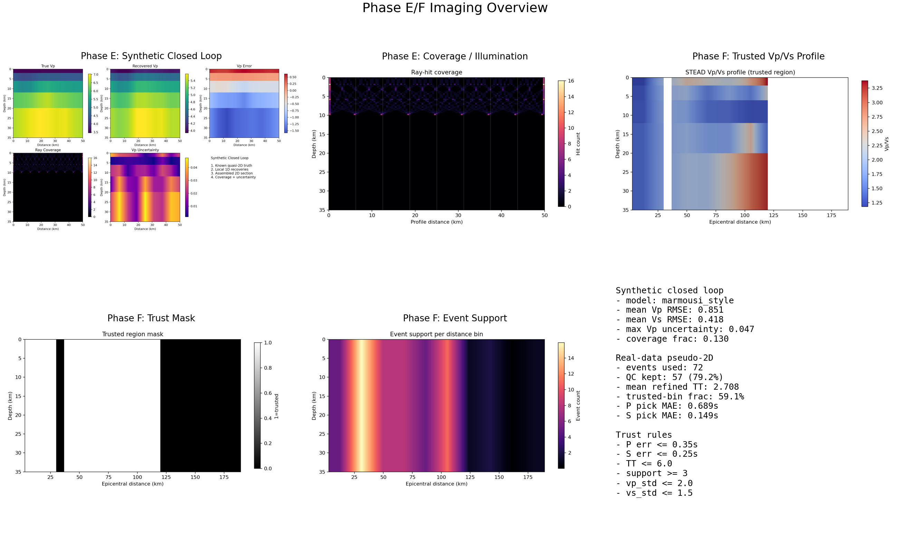

## I.4 Repository layout & short reproduce

```
HNF/
├── hnf/                    # library (kernel, picking, Physics Decoder, …)
├── docs/figures/           # README figures (+ interpret/, probing/, knowledge/)
├── outputs/CURRENT.md      # which dumps are canonical after prune
├── tools/                  # train / eval / download / explain helpers
├── scripts/                # all run_* drivers (see scripts/README.md)
│   ├── experiments/        # run11–run28 numbered picking launches
│   ├── interpret/          # interpret / probing / knowledge mining
│   ├── inversion/          # inv, proof, route A/A2, phase E/F
│   ├── paper/ / picking/ / domain/
└── docs/EXPERIMENT_PLAN.md
```

```bash
CKPT=outputs/run28/28_ms_fresnel_phys_20ep/best.pt
HEAD=outputs/physics_decoder_run28_macro/best_physics_head.pt

python tools/eval_stead_picking.py --checkpoint $CKPT
python scripts/interpret/run_interpret_suite.py --device cuda --checkpoint $CKPT \
  --output-dir outputs/interpret_suite_run28 --copy-to-docs
python scripts/interpret/run_probing_suite.py --device cuda --checkpoint $CKPT --copy-to-docs
python scripts/inversion/run_route_a2_waveform.py --checkpoint $CKPT --physics-head $HEAD \
  --head-mode macro --n-test 256 --output-dir outputs/route_a2_run28_macro_n256
```

---

# II. Interpretability

Two complementary tracks on the **frozen seismic model**:

1. **Parameter interpretability** — does γ, ω, χ, kernel rows, and ρ align with
   wave physics? (largely implemented in `scripts/interpret/run_interpret_suite.py`)
2. **Physical-neuron probing** — treat ρ / K activations as mechanistic units
   and test *causal* decision roles (partially implemented; roadmap below)

```bash
python scripts/interpret/run_interpret_suite.py --device cuda --copy-to-docs \
  --checkpoint outputs/run28/28_ms_fresnel_phys_20ep/best.pt \
  --output-dir outputs/interpret_suite_run28
# → outputs/interpret_suite_run28/interpret_report.json
# → docs/figures/interpret/ (mirrored)
```

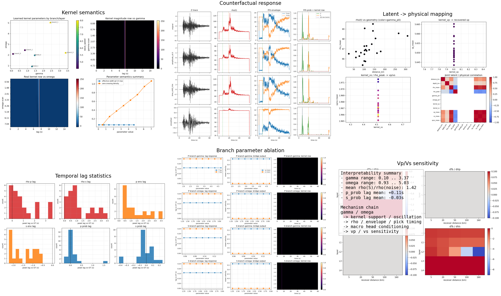

*Figure: γ/ω semantics, counterfactual waveform response, lag stats, branch
ablation, latent→physics mapping, and vp/vs TT sensitivity.*

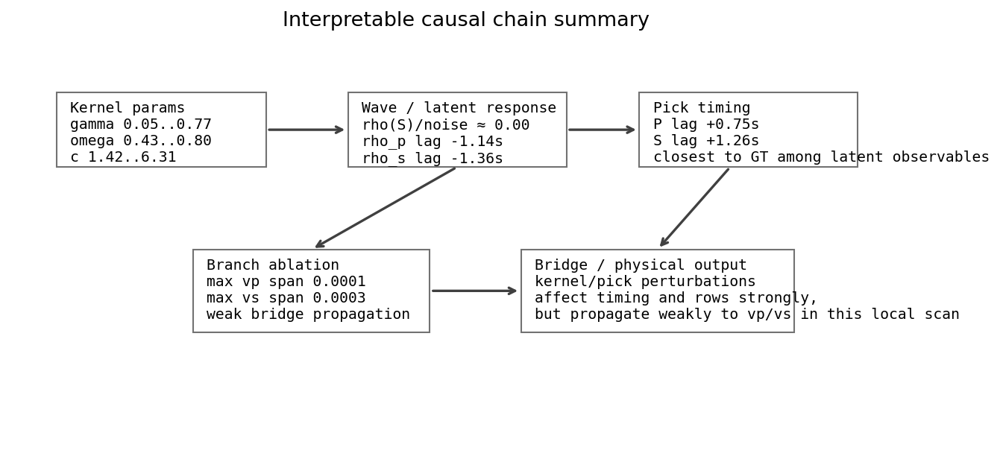

*Figure: evidence is strong on `gamma/omega → kernel → rho/picks`, weaker on
local branch knobs → bridge `vp/vs` under the current macro design.*

## II.1 Parameter interpretability (implemented)

### Kernel physics (Huygens vs Fresnel)

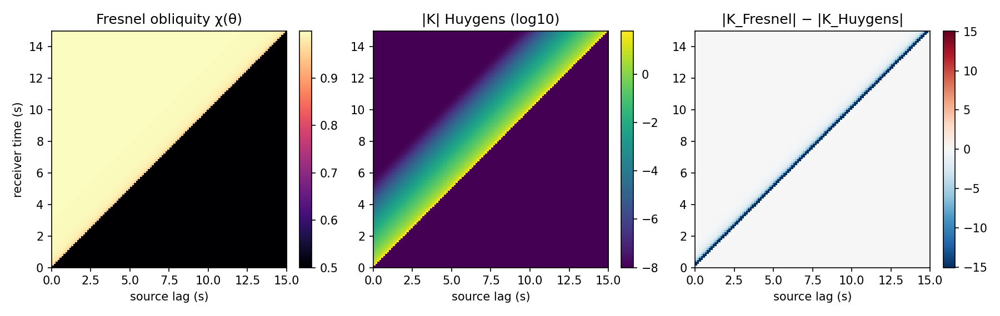

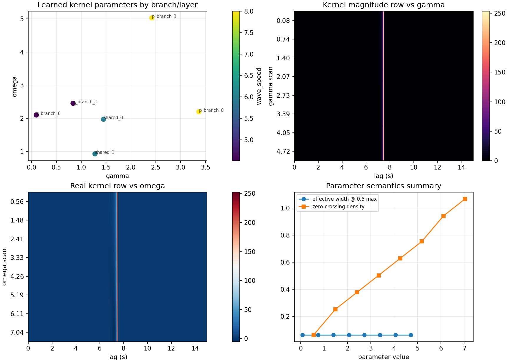

*Learned ranges (current run): `gamma ≈ 0.10..3.37`, `omega ≈ 0.93..5.03`,
`wave_speed ≈ 4.51..8.00`. Larger γ narrows support; larger ω increases
oscillatory phase along causal rows.*

### Picking explainability (run28 suite; figures may still show run20-era labels)

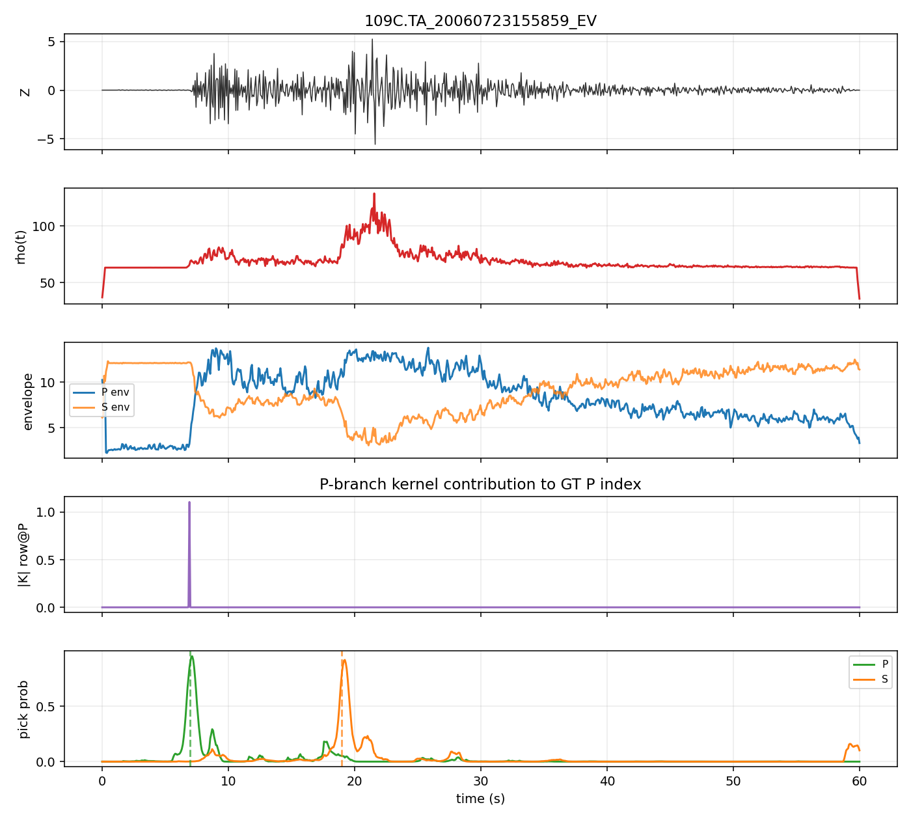

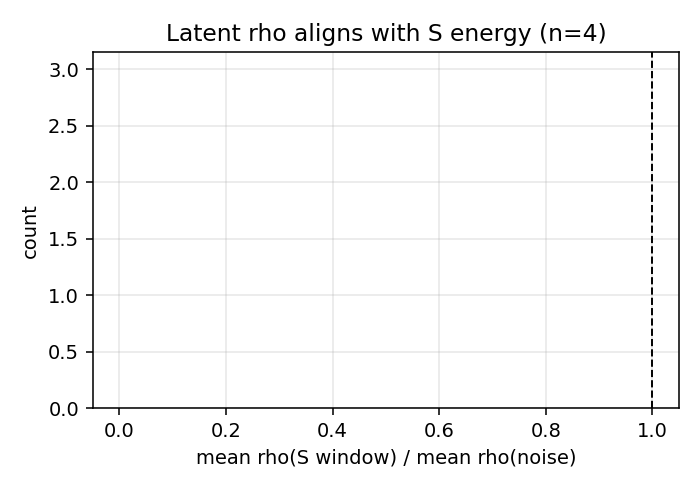

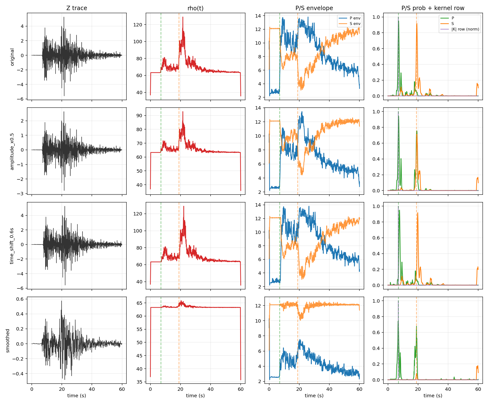

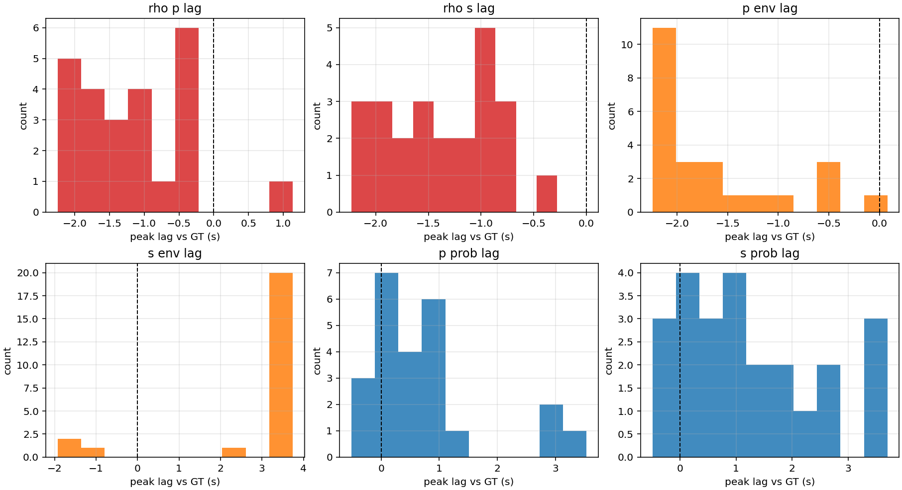

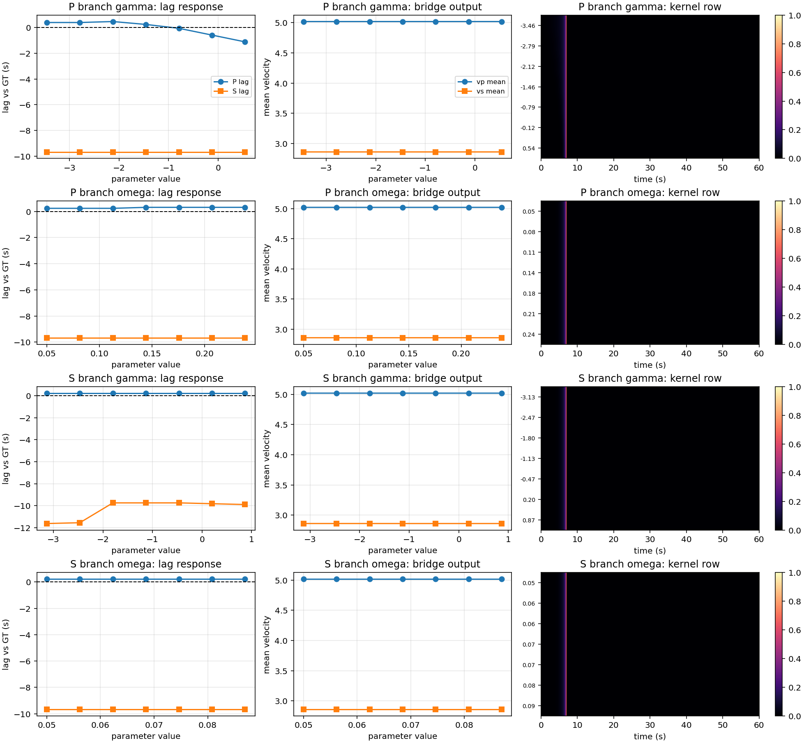

### Bridge latents & init→refine

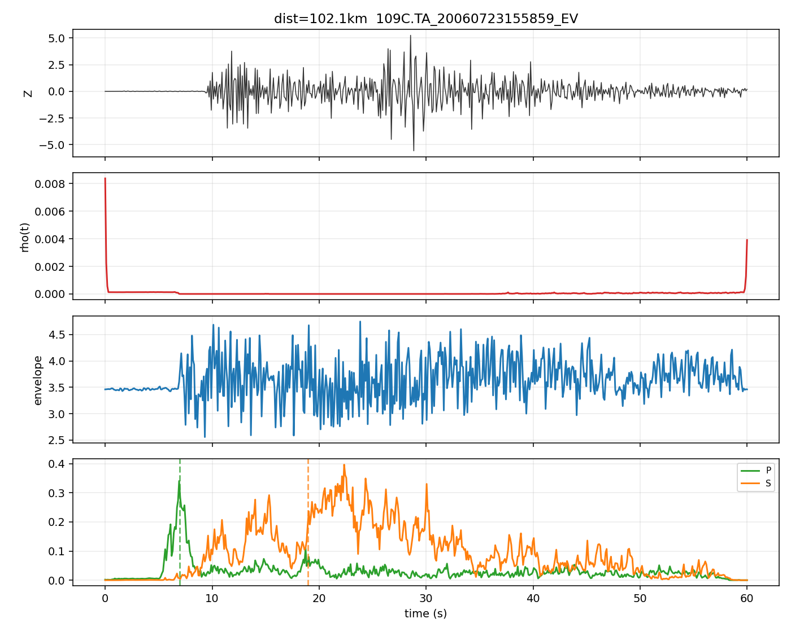

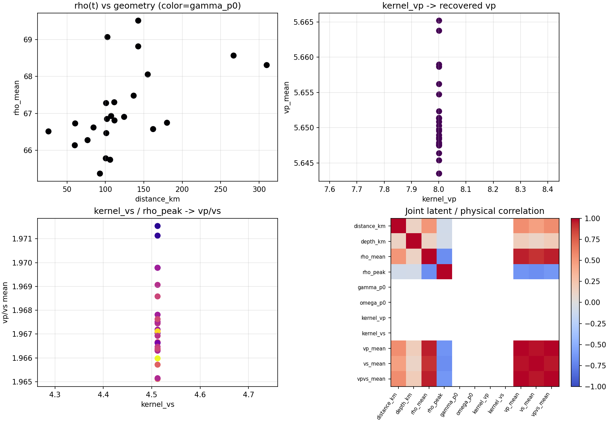

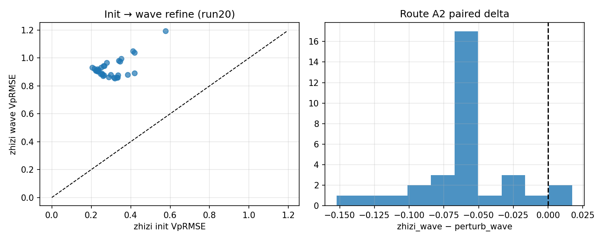

### Principle ablation (completed)

| Task | Huygens (run20) | Fresnel | Verdict |
|------|-----------------|---------|---------|
| Picking det F1 | 0.994 | **0.996** | Fresnel +0.002 |
| Picking P F1 | **0.959** | 0.925 | Fresnel −0.034 |
| Picking S F1 | **0.949** | 0.928 | Fresnel −0.022 |
| Route A2 win-rate | **93.8%** | 90.6% | still PASS |
| STEAD refine win-rate | **77.1%** | 77.1% | tie |

**Conclusion (updated):** picking **production** is **run28 (Fresnel kitchen-sink)**.
run20 Huygens remains the legacy A2 wave-win reference backbone. Early Fresnel
ablation on a short recipe underperformed run20 on P/S; the long run28 schedule
reversed that for picking metrics.

| Quantity | How to read it |
|----------|----------------|
| `rho(t)` | Soft latent weight; rises with energetic / S intervals — **not** crustal density |
| `gamma` / `omega` | Locality vs oscillation of the causal kernel |
| χ obliquity | Fresnel aperture; forward lags weighted more |
| Kernel row | Which past samples causally contribute to a pick index |
| Counterfactual waveform edits | Amplitude vs timing sensitivity |
| Branch ablation | Local γ/ω → pick lag / kernel shape / weak bridge coupling |

## II.2 Probing “physical neurons”

Script: `scripts/interpret/run_probing_suite.py` → `outputs/probing_suite_run28/` (+
`docs/figures/probing/`).

### (1) Causal-chain tracking **[done — first pass]**

Layer-wise wavefield energy + ρ panels for known events
(`docs/figures/probing/causal_chain/`). Peak-width “sharpening” metric is still
coarse (embed energy is already sparse); qualitative ladders are the keepers.

### (2) Counterfactual ρ scrubbing **[done — first pass]**

Zero / damp ρ near S onset through the forward path. On n=24: **ΔP/ΔS ≈ 0** —
under the current architecture ρ behaves as a **weak conditioner**, not a strong
causal pick switch. Waveform-level counterfactuals in the interpret suite remain
the stronger timing/amplitude evidence.

### (3) Anomaly detection & attribution **[partial]**

False-P-on-noise K-row gallery is implemented; first pass found few high-confidence
false P after thresholding. Re-run with relaxed thresholds when packaging Part II.

```bash
python scripts/interpret/run_probing_suite.py --device cuda --copy-to-docs \
  --checkpoint outputs/run28/28_ms_fresnel_phys_20ep/best.pt \
  --output-dir outputs/probing_suite_run28
```

---

# III. Physics discovery

After interpretability establishes *what internals mean*, discovery asks
*what regularities and transferable physics the trained stack implies*—still
using seismology as the worked example—and how to turn pieces of the network
back into equations / tables.

## III.1 Knowledge mining

Statistical mining over latents, kernel knobs, geometry, and physics outputs
along the mechanism chain
`gamma/omega → kernel → rho/picks → macro → vp/vs`
(with bootstrap / FDR / cross-head stability). Methodology:
[`docs/KNOWLEDGE_MINING.md`](docs/KNOWLEDGE_MINING.md).

```bash
python scripts/interpret/run_knowledge_mining.py
python scripts/interpret/run_knowledge_mining_cross.py   # outputs/knowledge_mining_v4
```

Key keepers / cautions:

- `noise_ratio → pick_err_p` is global, head-independent, and geo-confirmed
- `rho_p_lag → init_tt` transfers across physics heads and survives geo controls
- `rho_mean → vp_mean` is descriptive only (sign flips across heads)
- Direct event-wise `gamma/omega → vp/vs` is **not** appropriate: those knobs
  are global branch parameters in the current model

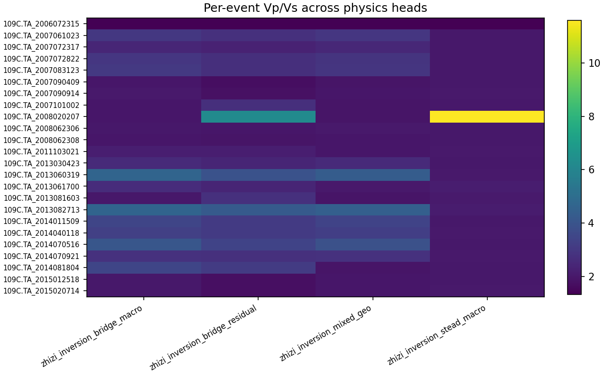

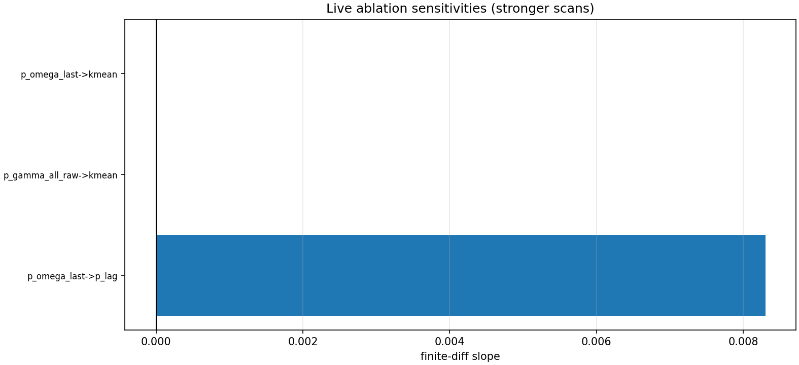

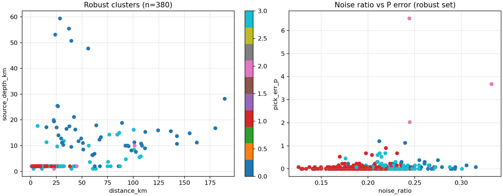

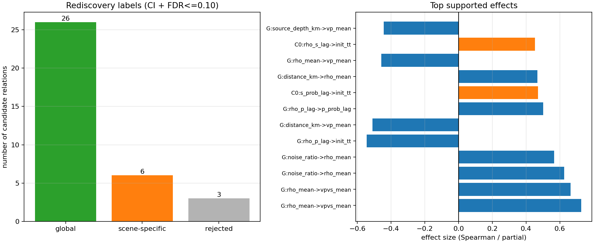

Paper-scale boards (SNR / Ambon / OBS / Fig1 / Fig4 / attributes) are summarized
in [`docs/PAPER_ROADMAP.md`](docs/PAPER_ROADMAP.md) with figures under
`docs/figures/`.

STEAD in-domain picking baselines (subset protocol):

| Model | det_f1 | P-F1 | S-F1 |
|-------|-------:|-----:|-----:|
| **HNF(run28-50ep)** | **0.998** | **0.980** | **0.965** |
| HNF(run28-20ep local) | 0.998 | 0.978 | 0.955 |
| HNF(run20) full test | 0.994 | 0.959 | 0.949 |
| EQT(STEAD) subset | **0.999** | **0.989** | **0.971** |
| PhaseNet(STEAD) subset | 0.997 | 0.949 | 0.959 |

Note: EQT/PhaseNet numbers are the paper subset protocol; HNF rows are full-test
(or declared schedule). run28 closes most of the PhaseNet gap and narrows EQT.

## III.2 Absolute-geography rediscovery

Attaching source/receiver lat–lon (`run_paper_geo_rediscovery.py`,
`run_paper_geo_confirm.py`) shows absolute geography carries signal, but mostly
as **regional / network structure** (ZQ-dominated sample), not a universal
latitude law.

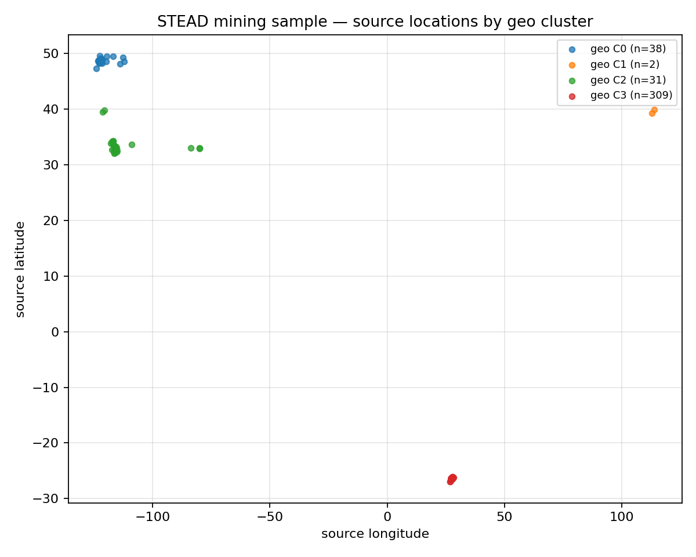

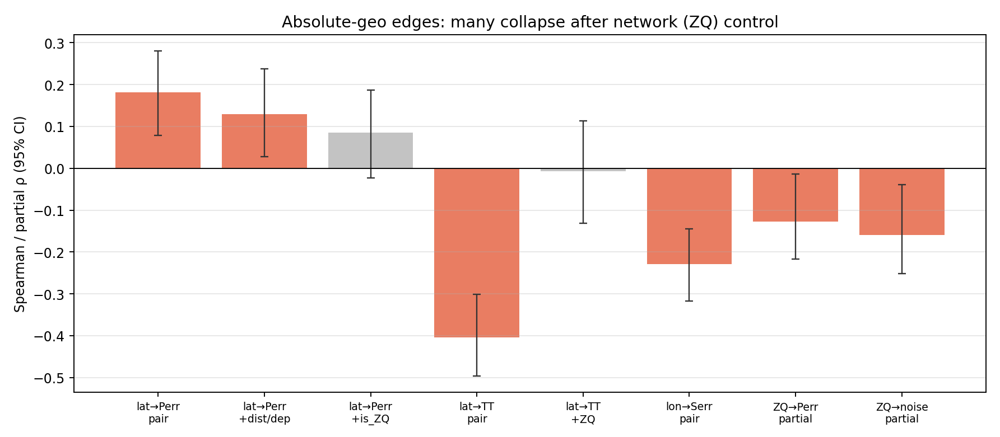

Confirmed (strong): `noise_ratio → pick_err_p` and `rho_p_lag → init_tt`
survive lat/lon **and** `is_ZQ`. Pairwise latitude→error edges often **collapse**
after network control—control `is_ZQ` (or equivalent) before claiming geo laws.

## III.3 Reparameterization → physical equations

Discovery is not only correlation tables. A parallel track **reparameterizes**
trained internals into analytic or classical forms that can be compared to
textbook Earth / wave models. Status: mostly **planned**, building on existing
exports.

### (1) Analytic medium parameters **[planned]**

Fit learned ρ-field summaries or γ-like behavior with spatial analytic
functions (e.g. polynomials in epicentral distance). A smooth
`γ(distance)` or `ρ_peak(distance)` would suggest a **describable attenuation /
focusing law** rather than opaque coordinates.

Hook: extend knowledge-mining distance buckets + kernel semantics panels into
explicit curve fits with residual reports.

### (2) Reverse-engineer empirical velocity models **[partial]**

From the trained Physics Head, extract the implied `vp/vs` deformation of the
reference layered model and compare to classical models (e.g. **AK135** /
local 1D tables). Systematic residuals can flag **regional corrections** or
dataset bias implicit in STEAD geometry.

Exists today: macro scale/contrast/ratio → `vp0/vs0`, latent diagnostics, TT
sensitivity heatmaps. Planned: published AK135-residual panels on geo clusters.

### (3) Operator simplification (low-rank K) **[planned]**

Analyze the rank structure of kernel matrices. If \(K\) is approximately
low-rank, SVD / leading components can approximate causal propagation with
fewer bases—cutting inference cost while testing how much “wave physics”
lives in a compact operator subspace.

```bash
# planned
python run_reparam_suite.py --checkpoint ... --compare ak135 --svd-ranks 1,2,4,8
```

---

# IV. Generalization

Parts I–III define a reusable research pattern on seismology. Domain transfer
asks whether the **same pattern**—sparse observation → HNF encoder → task head
/ Physics Decoder → interpretability → mining—holds outside earthquakes.

| Pattern step | Seismology (Domain I) | EEG (Domain II) | Fluid (Domain III) |
|--------------|----------------------|-----------------|--------------------|
| Sparse observation | 3C waveforms | multi-channel EEG | sparse 4D-flow voxels |
| Encoder | HNF picking backbone | HNF EEG encoder | HNF flow encoder |
| Physics / task head | picks + vp/vs | disease / state head | constitutive (η, λ, …) |
| Interpretable unit | ρ(t), γ, ω, K rows | ρ(t) / spectral proxies | kernel ↔ shear-rate |
| Discovery | geo + velocity residuals | group contrasts / ROC | residual vs base rheology |

## IV.1 Domain II — AD/FTD EEG

**Status:** code scaffolding in place; full train/eval after STEAD GPU bandwidth.

| Piece | Location |
|-------|----------|
| Dataset | `hnf/eeg_dataset.py` (OpenNeuro ds004504 / ADFTD) |
| Model | `hnf/eeg_model.py` |
| Train / eval | `tools/train_eeg.py`, `tools/eval_eeg.py`, `scripts/domain/run_eeg_analysis.py`, `tools/transfer_eeg.py` |
| Download | `tools/download_eeg_adftd.py` → `external_data/eeg_adftd/` |

Reuse from Domain I: multi-scale HNF blocks, ρ probing narrative, optional
frozen-backbone transfer. Claims stay at **classification / transfer metrics +
ρ group contrasts**, not overclaimed “EEG physics laws” until mining replicates
the FDR discipline from Part III.

## IV.2 Domain III — sparse flow → constitutive discovery

**Status:** design frozen in
[`docs/DOMAIN_III_FLUID_RHEOLOGY.md`](docs/DOMAIN_III_FLUID_RHEOLOGY.md);
GPU work after EEG Stage-1 (or explicit reprioritization).

Target loop: sparse velocity observations → denser flow reconstruction →
constitutive parameters → knowledge-mining residuals vs a base rheology family.
**RACLETTE** provides CFD-enhanced synthetic aortic 4D/5D flow for Stage 0–1
reconstruction realism—**not** constitutive GT by default.

```bash
python tools/download_raclette.py \
  --out-dir external_data/raclette/Tutorials/DataDownload/Downloaded
```

Planned modules (see Domain III doc): `hnf/fluid_dataset.py`, Physics Decoder
branch for (η, λ, …), momentum / constitutive residual losses.

## IV.3 Cross-domain checklist

For each new domain, repeat:

1. **Model** — freeze a competent encoder / head recipe (Part I)
2. **Interpretability** — parameter semantics + ρ/K probing (Part II)
3. **Discovery** — FDR-aware mining + optional reparameterization (Part III)
4. **Transfer report** — what ports, what breaks, what becomes domain-specific

Observational-system transfer inside seismology (OBS zero-shot vs
EQT/PhaseNet) remains a sibling stress test; see paper Fig5 and
`run_paper_obs_picking_compare.py`.
