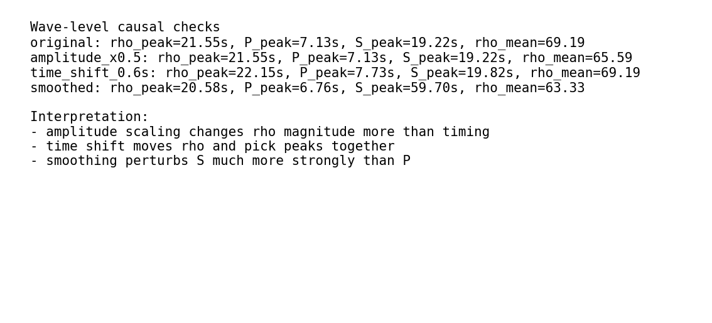
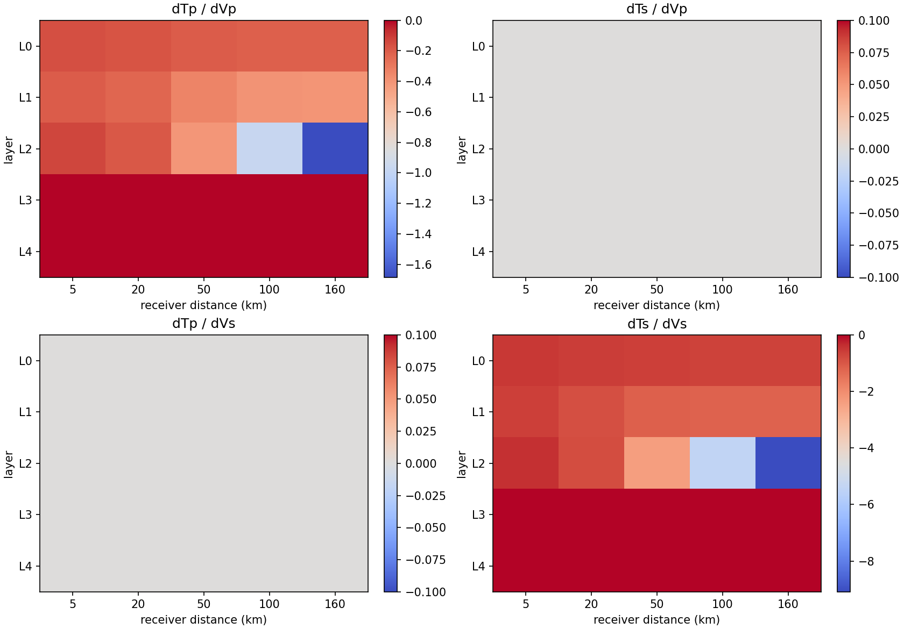

# Huygens Neural Field (HNF)

A physics-inspired neural field built on the Huygens principle. A learnable complex kernel models wave-like interactions; the same stack supports sparse field reconstruction, STEAD phase picking, and 1D velocity inversion with a frozen picking backbone (“Zhizi” bridge).

```
Kernel + density design
  → Framework (layers, field reconstruction)
  → STEAD classification & phase picking (run20)
  → 1D travel-time / FWI-lite baselines
  → Zhizi inversion bridge (macro Physics Head)
  → Proof suite (geometry-aware STEAD + baselines + latent plots)
  → Interpretability suite (kernel χ, contrib rows, ablations)
```

| Stage | Artifact | Result |
|-------|----------|--------|
| Picking | `outputs/run20/20_wrongpeak_sharp/best.pt` | det F1 **0.994** / P **0.959** / S **0.949** (~**139k** params) |
| Inversion init | `outputs/zhizi_inversion_bridge_macro/best_physics_head.pt` | Waveform refine win-rate **93.8%** (synth); STEAD geom refine **77.1%** |

Figures below live in [`docs/figures/`](docs/figures/) (copied from completed `outputs/` runs). Inversion recipe details: [`README_ZHIZI_INVERSION.md`](README_ZHIZI_INVERSION.md).

---

## Setup

```bash
cd HNF
pip install -r requirements.txt
```

- Python deps: `torch>=2.0`, `numpy`, `matplotlib`, `pytest`, `tqdm`, `openpyxl`
- Place STEAD under `STEAD/` (~90GB; gitignored)
- Large run products stay in `outputs/` (gitignored); key plots are mirrored to `docs/figures/`
- GPU ≥12GB recommended; picking uses `seq_len=800`; bridge inference often uses `infer_seq_len=600`

```bash
python -c "from hnf import HuygensKernel, HuygensNeuralField, STEADHNFPickingModel; print('ok')"
pytest hnf/tests -q
```

---

## 1. Model design

Huygens kernel (`hnf/kernel.py`):

\[
K_{\text{Huygens}}(x_i,x_j)=\frac{1}{r^2+\varepsilon}\exp(-\gamma r^2)\exp(i\,\omega r)
\]

**Huygens–Fresnel** variant (`--principle huygens_fresnel`): spherical \(1/r\) amplitude, extra \(i\omega/(2\pi)\) phase, and obliquity \(\chi(\theta)=\tfrac12(1+\cos\theta)\) suppressing off-axis secondary sources. Selected via `--principle` on the picking trainer; default remains `huygens`.

| Piece | Role |
|-------|------|
| Complex phase `exp(i ω r)` | Interference / travel-time structure |
| Gaussian envelope `exp(-γ r²)` | Local secondary-source weight |
| Causality + wave speed | Directed temporal propagation |
| Learnable γ, ω, wave_speed | Soft physical adaptation |
| Distance modes: feature / time / hybrid | Field coordinates or waveform time |

Supporting modules:

- **`DensityNet`** (`density.py`) — spatial density ρ(x), Softplus-positive
- **`HuygensWaveLayer` / `HuygensAttention`** (`layers.py`) — stack the kernel in deep models
- **`FastMultipoleMethod`** (`fmm.py`) — far-field acceleration
- **`DeepHuygensKernel`**, **`BayesianHNF`** — deeper / uncertainty variants

In the picking model, **ρ(t)** and kernel wave-speed are **soft conditioners**, not literal crustal density or absolute velocity. Physical `vp/vs` comes from the physics head + refinement.

---

## 2. Field reconstruction

`HuygensNeuralField` solves a kernel regression from sparse observations:

```
(x_obs, y) → K_obs = Re(K(obs,obs))
         → w = (K_obs + αI)^{-1} y
         → field = Re(K(target,obs)) @ w
```

```bash
python example_2d_reconstruction.py
python example_2d_reconstruction.py --field-type vortex --n-obs 200 --train-steps 300
```

Plot helpers: `hnf/visualize.py`. Kernel demos: `hnf/demos.py` (`demo_causality`, `demo_fmm_benchmark`, …).

---

## 3. STEAD: classification → phase picking

### Classification

```bash
python train_stead.py --device cuda
```

Validates Huygens attention on STEAD earthquake / noise waveforms.

### Picking model (`STEADHNFPickingModel`)

Three-component secondary sources → temporal `rho(t)` → Huygens wave blocks (optional noise-cancel branch) → det / P / S heads (envelope-residual pick heads).

Trainer: `train_stead_picking.py`. Orchestration scripts: `run11_stead_picking.py` … `run20_stead_picking.py`.

Design choices retained in the final model:

- Preserve full temporal resolution and stable detection, then push P/S
- Denoise branch primarily for **det**; P/S use **raw** waveform plus denoise cues
- Stage-wise freezing of backbone / det while refining pick heads
- Short low-LR sharp pass with wrong-peak suppression (**run20**)

**Frozen checkpoint**

```text
outputs/run20/20_wrongpeak_sharp/best.pt
  det_f1 ≈ 0.994   p_f1 ≈ 0.959   s_f1 ≈ 0.949   n_params ≈ 139402
```

```bash
python run20_stead_picking.py
python eval_stead_picking.py --checkpoint outputs/run20/20_wrongpeak_sharp/best.pt
python explain_stead_picking.py --checkpoint outputs/run20/20_wrongpeak_sharp/best.pt
```

Dataset: `hnf/stead_picking_dataset.py` (includes `source_distance_km` / `source_depth_km` for real-event geometry).

**Pick threshold sweep**


*Figure: threshold vs picking metrics on the run20 model (`picking_threshold_sweep.png`).*

---

## 4. 1D inversion baselines

Before the Zhizi bridge, a layered-Earth stack was built and compared end-to-end.

| Component | Module |
|-----------|--------|
| Layered Earth + P/S travel times | `hnf/inversion_1d.py` |
| Gauss–Newton / L-BFGS / Adam | `hnf/inversion_baselines.py` |
| Acoustic FWI-lite | `hnf/acoustic_fwi_1d.py` |
| Synthetic waveforms | `hnf/synth_waveforms_1d.py` |
| Ray paths | `hnf/ray_paths.py` |
| Profile / misfit plots | `hnf/inv_plot.py` |

```bash
python run_inv01_synth_1d.py
python run_inv_full_compare.py
python run_inv_fwi_lite.py
python run_inv05_pick_to_inversion.py
```

**Takeaway:** classical travel-time solvers (esp. GN / L-BFGS) reach the lowest absolute Vp RMSE on synthetic oracles. Waveform FWI-lite improves from a given start model. The Zhizi line therefore targets a **better waveform-inversion initializer**, scored against a standard perturbed start.


*Figure: multi-method 1D inversion overview (`full_comparison.png`).*

---

## 5. Zhizi inversion bridge

### Pipeline

```
Frozen run20
  → station features: rho(t), envelope, kernel soft scales, P/S picks
  → macro Physics Head: scale / contrast / Vs ratio
  → vp0/vs0 relative to a reference layered model (zero init ≈ reference)
  → short differentiable waveform refine (Route A2) or travel-time refine
```

Code: `hnf/zhizi_physics_head.py`, `zhizi_inversion_bridge.py`, `zhizi_inversion_dataset.py`, `zhizi_inversion_loss.py`.

### Training (converged recipe)

Short training is sufficient; best Val Vp RMSE ≈ **0.277** near epoch 4.

```bash
python train_zhizi_inversion.py \
  --head-mode macro --epochs 8 --n-train 96 --n-val 16 \
  --unrolled-weight 0.5 --unrolled-steps 5 \
  --vp-sup-weight 0.05 --lr 3e-3 \
  --output-dir outputs/zhizi_inversion_bridge_macro
```

Checkpoint: `outputs/zhizi_inversion_bridge_macro/best_physics_head.pt`.


*Figure: validation Vp RMSE, total loss, and unrolled Vp MSE (`training_curves.png`). Best early in the run.*

### Route A2 (synthetic waveform refine)

```bash
python run_route_a2_waveform.py \
  --head-mode macro \
  --physics-head outputs/zhizi_inversion_bridge_macro/best_physics_head.pt \
  --n-test 32 --fwi-steps 60 --device cuda
```

| Setting | Zhizi + wave VpRMSE | Perturb + wave | Zhizi better |
|---------|---------------------|----------------|--------------|
| 32 events | **0.924** | 0.982 | **93.8%** |
| 64 events | **0.935** | 0.977 | **87.5%** |

One-shot init need not beat a hand perturbation; the macro deformation more often lands FWI-lite in a better basin.

---

## 6. Proof suite (geometry-aware STEAD + baselines + latents)

```bash
python run_proof_suite.py --device cuda --max-events 48 --n-synth 32 \
  --output-dir outputs/proof_suite
```

Full JSON: `outputs/proof_suite/proof_report.json`. Figures below are the same plots shipped in `docs/figures/`.

### STEAD with real epicentral distance / depth (n=48)

| Metric | Zhizi refine | Perturb refine |
|--------|--------------|----------------|
| Mean TT misfit | **3.08** | 11.22 |
| Win rate | **77.1%** | — |
| Wilcoxon (approx.) | p ≈ 3×10⁻⁵ | — |


*Figure: points below the diagonal favor Zhizi after travel-time refine (`stead_refine_scatter.png`).*


*Figure: TT misfit delta vs distance (color = depth) and win-rate by distance bin (`stead_geom_conditioning.png`). Longer ranges show higher Zhizi win rates.*

### Synthetic full baseline compare (n=32)

| Method | Mean Vp RMSE |
|--------|--------------|
| zhizi_wave | **0.924** |
| perturb_wave | 0.982 |
| gn_tt (travel-time oracle) | 0.136 |
| lbfgs_tt | 0.201 |
| adam_tt | 1.597 |

Zhizi vs perturb (wave): Wilcoxon p ≈ 6×10⁻⁷.


*Figure: mean Vp RMSE across init / wave refine / TT solvers (`synth_full_compare_bars.png`).*


*Figure: paired `zhizi_wave − perturb_wave` (negative = Zhizi better) (`synth_wave_delta_hist.png`).*

### Ray paths


*Figure: direct P/S rays for True / Zhizi init / Zhizi+wave models (`example_paths.png`).*

### Intermediate variables (ρ, envelope, picks, macro)


*Figure: Z waveform, latent **ρ(t)**, wavefield envelope, and P/S pick curves with ground-truth onsets. ρ rises with strong energy (esp. S), aligned with phase arrivals (`latent_case_00.png`).*


*Figure: mean ρ vs epicentral distance on latent sample cases (`rho_vs_distance.png`).*


*Figure: macro-implied Vp scale / contrast / Vs·Vp, ρ vs geometry, kernel soft prior, and scale–contrast coupling on STEAD (`macro_latent_diagnostics.png`).*

| Quantity | Reading from the plots |
|----------|-------------------------|
| `rho(t)` | Soft latent weight; spikes with energetic / S intervals |
| Envelope | Complex wavefield energy tracking phase structure |
| kernel_vp / vs | Dimensionless soft scales conditioning the head |
| macro (scale, contrast, ratio) | Low-dim deformation of the reference layered model |

Reproduce helper: `bash scripts/reproduce_macro_route.sh`.

---

## 7. Imaging output: synthetic closed loop -> real-data profile

The bridge is no longer only a picking / inversion metric story. It now
produces image-style structural outputs in two stages:

1. `Phase E`: recover a known quasi-2D synthetic model and verify that the
   assembled section matches truth with explicit coverage / uncertainty maps.
2. `Phase F`: transfer the same local-1D-to-section idea to real STEAD events,
   aggregate along epicentral distance, and expose trusted vs fragile regions.

```bash
# Synthetic image closed loop
python run_phase_e_synth_imaging.py --device cuda --output-dir outputs/phase_e_formal

# Real-data pseudo-2D profile with QC/trust mask
python run_phase_f_stead_profile.py --device cuda --output-dir outputs/phase_f_qc

# README/report-ready combined panel
python run_phase_ef_overview.py \
  --phase-e-report outputs/phase_e_formal/report.json \
  --phase-f-report outputs/phase_f_qc/report.json \
  --output-dir outputs/phase_ef_overview
```

### Phase E: synthetic closed loop

`outputs/phase_e_formal/report.json` summarizes the formal synthetic imaging
run:

| Metric | Value |
|--------|-------|
| Model type | `marmousi_style` |
| Mean Vp RMSE | **0.851** |
| Mean Vs RMSE | **0.418** |
| Max Vp uncertainty | **0.047** |
| Coverage nonzero fraction | **0.130** |

This is the key proof that the framework can go from sparse observations to a
readable 2D geologic image while still exposing where it is illuminated and
where it is uncertain.

### Phase F: QC-filtered real-data pseudo-2D

`outputs/phase_f_qc/report.json` summarizes the first trusted real-data profile:

| Metric | Value |
|--------|-------|
| Events used | **72** |
| QC-kept events | **57** |
| QC keep fraction | **79.2%** |
| Mean refined TT misfit | **2.708** |
| Mean events per bin | **5.7** |
| Trusted-bin fraction | **59.1%** |
| P pick MAE | **0.689 s** |
| S pick MAE | **0.149 s** |

Default QC thresholds:

- `pick_err_p <= 0.35 s`
- `pick_err_s <= 0.25 s`
- `refined_tt <= 6.0`
- `event_count >= 3`
- `vp_std <= 2.0`
- `vs_std <= 1.5`

These rules generate `trust_mask` and masked `Vp / Vs / VpVs` panels so the
real-data image can be presented with an explicit confidence boundary rather
than a full unqualified interpolation.


*Figure: synthetic closed-loop evidence (top/left) and QC-filtered real-data
profile with trust mask and support maps (right/bottom) assembled into one
overview panel (`phase_ef_overview.png`).*

---

## 8. Interpretability suite

Quantitative + visual evidence that internal variables align with physical phase structure (not post-hoc labels).

```bash
python run_interpret_suite.py --device cuda --copy-to-docs
# → outputs/interpret_suite/interpret_report.json
# → docs/figures/interpret/
```


*Figure: one-page summary of the current interpretability chain: kernel parameter semantics (`gamma`, `omega`), counterfactual waveform response, temporal lag statistics, branch-level parameter ablation, latent-to-physical mapping, and `vp/vs` travel-time sensitivity (`interpretability_summary_panel.png`).*


*Figure: structural causal-chain summary for the current HNF stack. The present evidence supports a strong path from `gamma/omega` to kernel support / oscillation, then to `rho(t)` and pick timing, but only a weak local propagation from branch-specific kernel perturbations into downstream `vp/vs` under the current macro-bridge design (`causal_chain_graph.png`).*



*Figure: wave-level causal checks from counterfactual perturbations. Amplitude scaling mainly changes `rho` magnitude, time shifting moves `rho` and pick peaks together, and heavy smoothing disturbs S-related behavior more strongly than P (`causal_wave_summary.png`).*

### A. Kernel physics (Huygens vs Fresnel)


*Figure: Fresnel obliquity χ (left), log|K| Huygens (center), |K_Fresnel|−|K_Huygens| (right). Obliquity damps off-axis lags; kernel difference concentrates on longer causal lags.*


*Figure: χ and |K| along one causal receiver row — forward cone structure.*


*Figure: learned branch/layer kernel parameters (`gamma`, `omega`, `wave_speed`), plus explicit row scans showing that larger `gamma` narrows effective support while larger `omega` increases oscillatory phase structure. In the current run the learned ranges are approximately `gamma ≈ 0.10..3.37`, `omega ≈ 0.93..5.03`, and `wave_speed ≈ 4.51..8.00` (`kernel_gamma_omega_semantics.png`).*

### B. Picking explainability (run20)


*Figure: Z trace, ρ(t), P/S envelopes, **|K| row at GT P index** (causal contributions), and pick curves. Kernel energy peaks near the P onset window.*


*Figure: ratio of mean ρ in S window vs pre-event noise; values > 1 indicate ρ tracks energetic phases.*


*Figure: counterfactual perturbations on the same event. Pure amplitude scaling mostly lowers mean `rho` without moving the peak times, while time shifting carries `rho(t)` and pick peaks together; heavy smoothing can distort S behavior much more strongly than P (`counterfactual_response_panel.png`).*


*Figure: peak-lag histograms relative to GT arrivals. `p_prob` and `s_prob` stay closest to the catalog onsets, while `rho(t)` and branch envelopes peak in broader windows around them; in this run `p_prob` mean lag is about `+0.11s`, `s_prob` about `-0.03s` (`temporal_lag_statistics.png`).*


*Figure: local scans of `p_branch_0` / `s_branch_0` kernel parameters. Each row perturbs one `gamma` or `omega` while tracking pick lag, bridge `vp/vs` mean response, and the normalized kernel row. After fixing the perturbed-bridge path, the main conclusion still holds: these branch-local kernel knobs clearly move pick timing and kernel concentration, but only weakly propagate into downstream `vp/vs` in the current architecture (`branch_parameter_ablation.png`).*

### C. Bridge latents (macro head)


*Figure: frozen run20 features through the Zhizi bridge — ρ(t), envelope, P/S logits vs GT onsets.*


*Figure: joint view from geometry and latent variables to recovered physical outputs. The scatter panels connect `rho(t)`, kernel soft scales, and recovered `vp/vs`, while the correlation panel summarizes which quantities move together across STEAD cases (`joint_latent_physics_summary.png`).*

### D. Init → wave refine (Route A2)


*Left: one-shot init VpRMSE vs after waveform refine (points below diagonal = refine helps). Right: paired zhizi−perturb wave delta (negative = Zhizi better).*



*Figure: finite-difference travel-time sensitivity heatmaps. `dTp/dVp` and `dTs/dVs` dominate as expected, while cross-sensitivities remain weaker; this helps explain which layers and offsets mainly constrain `vp` versus `vs` (`vp_vs_tt_sensitivity.png`).*

| Quantity | How to read it |
|----------|----------------|
| `rho(t)` | Soft latent weight; rises with S / high-energy intervals — **not** crustal density |
| `gamma` | Kernel locality control; larger values shrink the effective causal support |
| `omega` | Kernel oscillation / phase sensitivity; larger values increase sign changes along causal rows |
| χ obliquity | Fresnel aperture; forward lags weighted more than grazing paths |
| Kernel row | Which past samples causally contribute to a pick index |
| Counterfactual response | Distinguishes amplitude sensitivity from timing sensitivity |
| Temporal lag stats | Quantifies whether latent peaks lead, align with, or lag GT arrivals |
| Branch parameter ablation | Local parameter scan linking one kernel knob to lag, kernel shape, and bridge output |
| Causal chain visuals | Summarize which links are strongly supported and which remain weak |
| macro (scale, contrast, ratio) | Low-dim deformation of the reference layered model |
| `vp` / `vs` sensitivity | Which layer-distance pairs mainly constrain P and S travel times |

### F. Toward statistical knowledge mining

The next step is no longer only visual interpretability, but **statistical
knowledge mining** over:

- latent quantities: `rho(t)`, `rho_mean`, `rho_peak`, lag statistics
- kernel quantities: `gamma`, `omega`, `wave_speed`, branch-specific parameters
- physical outputs: `vp`, `vs`, `vp/vs`
- geometry / quality variables: distance, depth, support, uncertainty, TT misfit

The new causal-chain views are intended to guide that mining stage: future
statistical reports should test not only pairwise correlations, but also
whether discovered regularities remain stable along the mechanism chain
`gamma/omega -> kernel behavior -> rho/picks -> macro conditioning -> vp/vs`,
with confidence intervals, p-values, and stability checks.

The first pass of this pipeline is now implemented in
`run_knowledge_mining.py`. It exports a unified sample-level table plus
bootstrap/FDR-screened candidate relations. The current initial result is
deliberately conservative: no stable event-level law has yet been confirmed in
the screened set, and direct event-wise `gamma/omega -> vp/vs` correlation is
not appropriate because those kernel parameters are global branch parameters in
the current model. See `docs/KNOWLEDGE_MINING.md` for the current methodology
and why future mining should emphasize local sensitivity, mediation, and
cross-checkpoint comparisons.

The second pass now adds partial correlation, distance/depth bucket summaries,
and mediation-style chain screening. The current most interesting candidate is
not a raw `rho_mean` relation, but a weak positive partial link from
`rho_p_lag` to `refined_tt` after controlling for geometry and `pick_err_p`.
It is still not FDR-significant, so it should be treated as a **candidate
causal-chain signal**, not a confirmed law.

The third pass adds robust trimming and a same-sample multi-head comparison.
After trimming the strongest tail cases, the `rho_p_lag -> refined_tt`
candidate becomes slightly stronger rather than disappearing, and
`rho_mean -> vp_mean` also begins to show a weak edge signal. Neither is yet
FDR-significant, but this shifts the most promising knowledge-mining direction
from raw geometry or raw `rho_mean` trends toward **timing-aware latent
features plus cross-head comparison**.

### E. Principle ablation: Huygens–Fresnel (completed)

`python run_huygens_fresnel_iterate.py` replayed picking + macro inversion with `--principle huygens_fresnel`.


| Task | Huygens (run20) | Fresnel | Verdict |
|------|-----------------|---------|---------|
| Picking det F1 | 0.994 | **0.996** | Fresnel +0.002 |
| Picking P F1 | **0.959** | 0.925 | Fresnel −0.034 |
| Picking S F1 | **0.949** | 0.928 | Fresnel −0.022 |
| Route A2 win-rate | **93.8%** | 90.6% | still PASS |
| STEAD refine win-rate | **77.1%** | 77.1% | tie |

**Conclusion:** Fresnel does **not** replace the frozen run20 backbone (P/S regression). It remains an optional `--principle` for ablation; production path stays **run20 + macro**.

---

## 9. Repository layout

```
HNF/
├── hnf/                         # kernel, layers, field, picking, inversion, Zhizi bridge
│   ├── kernel.py density.py layers.py fmm.py field.py ...
│   ├── picking_model.py noise_cancel.py multiscale.py
│   ├── inversion_1d.py inversion_baselines.py acoustic_fwi_1d.py ray_paths.py
│   ├── zhizi_*.py
│   └── tests/
├── docs/figures/                # figures embedded in this README
│   └── interpret/               # interpretability suite mirrors
├── train_stead_picking.py
├── run11 … run20_stead_picking.py
├── train_zhizi_inversion.py
├── run_route_a2_waveform.py / run_zhizi_inv05_real.py / run_proof_suite.py
├── run_interpret_suite.py / run_huygens_fresnel_iterate.py
├── run_inv*.py
├── example_2d_reconstruction.py / train_stead.py
├── explain_stead_picking.py
├── scripts/reproduce_macro_route.sh
└── README_ZHIZI_INVERSION.md
```

---

## 10. Short reproduce path

```bash
# Picking (skip if run20 checkpoint exists)
python run20_stead_picking.py

# Macro head (skip if best_physics_head.pt exists)
python train_zhizi_inversion.py --head-mode macro --epochs 8 ...

# Performance proof (metrics + figures)
python run_proof_suite.py --device cuda --max-events 48 --n-synth 32

# Interpretability proof (kernel χ, contrib, ablations → docs/figures/interpret/)
python run_interpret_suite.py --device cuda --copy-to-docs
```

Open `outputs/proof_suite/proof_report.json`, `outputs/interpret_suite/interpret_report.json`, and `docs/figures/`.
