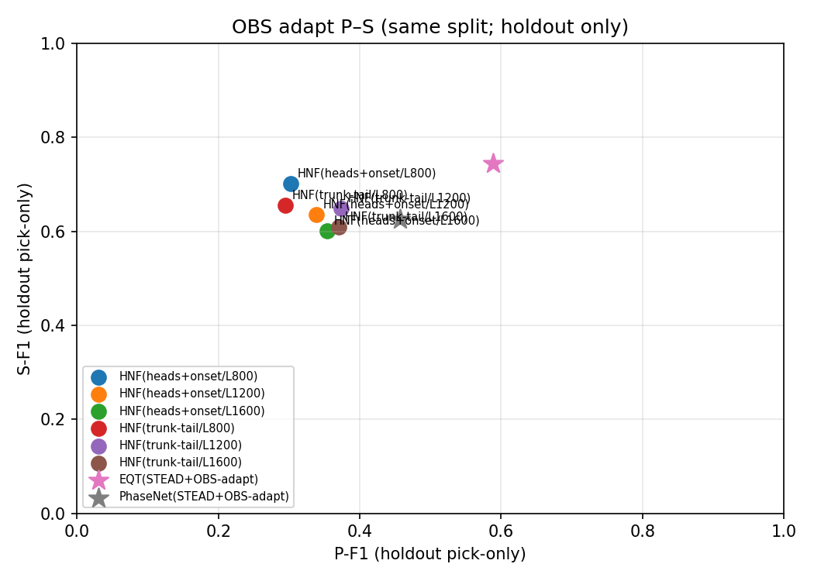
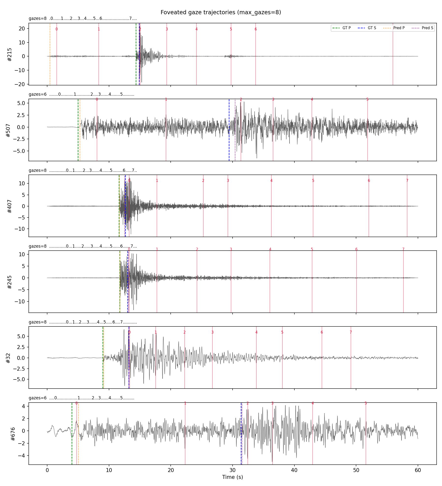

# Huygens Neural Field (HNF)

A physics-inspired neural field built on the Huygens principle. A learnable
complex kernel models wave-like interactions; the same research pattern—
**model → interpretability / probing → physics discovery → domain transfer**—
is developed first on seismology (STEAD picking + Physics Decoder), then
extended to EEG and sparse fluid flow.

```
I. Model                kernel, architecture, STEAD picking, Physics Decoder
II. Interpretability    parameter proofs + physical-neuron probing
III. Physics discovery  knowledge mining, geography, reparameterization
IV. Generalization      Domains II (EEG) / III (fluid rheology)
```

| Stage | Artifact | Result |
|-------|----------|--------|
| Picking (primary) | `outputs/run28/28_ms_fresnel_phys_50ep_local/best.pt` | STEAD full test: det **0.9986** / P **0.9842** / S **0.9756** (MAE 0.021/0.088 s; ~192k; best ep37) |
| Picking (legacy) | `outputs/run20/20_wrongpeak_sharp/best.pt` | det 0.994 / P 0.959 / S 0.949 (~139k) |
| Decoder (preferred) | `outputs/physics_decoder_run28_macro/best_physics_head.pt` | val VpRMSE **0.136**; A2 n=256 **init** 0.173 (vs perturb 0.146; init-win 41%) |
| Decoder (ks variant) | `outputs/physics_decoder_run28_macro_ks/` | +kernel_summary + mid-TT; A2 wave-win 56% (still soft) |
| Legacy Decoder | `outputs/zhizi_inversion_bridge_macro/` | run20-macro A2 **wave-win 91%** (init weak 0.304) |

Figures: [`docs/figures/`](docs/figures/). Outputs index: [`outputs/CURRENT.md`](outputs/CURRENT.md).
Inversion notes: [`README_ZHIZI_INVERSION.md`](README_ZHIZI_INVERSION.md).
Plan: [`docs/EXPERIMENT_PLAN.md`](docs/EXPERIMENT_PLAN.md) —
**Step 4–8 done** → Foveated first board complete (test P/S 0.917/0.940 @7.4 gazes).

> **Parts I–III use seismology as the running example.** Part IV reuses the
> same four-step pattern on other sparse-observation domains.
>
> **Decoder claim (current):** run28 macro is a stronger **FWI-lite initializer**
> than run20-macro (large-N init). Do **not** advertise 90%+ Route A2 wave-win
> for the run28 stack; that remains a run20-macro specialty.

---

# I. Model

Setup, design, structure, and the seismic training / evaluation stack.

## I.1 Setup

```bash
cd HNF
pip install -r requirements.txt
```

- Python deps: `torch>=2.0`, `numpy`, `matplotlib`, `pytest`, `tqdm`, `openpyxl`
- Place STEAD under `STEAD/` (~90GB; gitignored)
- Large run products stay in `outputs/` (gitignored); key plots mirror to `docs/figures/`
- GPU ≥12GB recommended; picking uses `seq_len=800`; bridge inference often uses `infer_seq_len=600`

```bash
python -c "from hnf import HuygensKernel, HuygensNeuralField, STEADHNFPickingModel; print('ok')"
pytest hnf/tests -q
```

## I.2 Model design

Huygens kernel (`hnf/kernel.py`):

\[
K_{\text{Huygens}}(x_i,x_j)=\frac{1}{r^2+\varepsilon}\exp(-\gamma r^2)\exp(i\,\omega r)
\]

**Huygens–Fresnel** variant (`--principle huygens_fresnel`): spherical \(1/r\)
amplitude, extra \(i\omega/(2\pi)\) phase, and obliquity
\(\chi(\theta)=\tfrac12(1+\cos\theta)\) suppressing off-axis secondary sources.
Selected via `--principle` on the picking trainer; default remains `huygens`.

| Piece | Role |
|-------|------|
| Complex phase `exp(i ω r)` | Interference / travel-time structure |
| Gaussian envelope `exp(-γ r²)` | Local secondary-source weight |
| Causality + wave speed | Directed temporal propagation |
| Learnable γ, ω, wave_speed | Soft physical adaptation |
| Distance modes: feature / time / hybrid | Field coordinates or waveform time |

Supporting modules:

- **`DensityNet`** (`density.py`) — spatial / temporal density ρ, Softplus-positive
- **`HuygensWaveLayer` / `HuygensAttention`** (`layers.py`) — stack the kernel in deep models
- **`FastMultipoleMethod`** (`fmm.py`) — far-field acceleration
- **`DeepHuygensKernel`**, **`BayesianHNF`** — deeper / uncertainty variants

In the picking model, **ρ(t)** and kernel wave-speed are **soft conditioners**,
not literal crustal density or absolute velocity. Physical `vp/vs` comes from
the Physics Decoder + optional waveform refine.

## I.3 Model structure

### Field reconstruction

`HuygensNeuralField` solves kernel regression from sparse observations:

```
(x_obs, y) → K_obs = Re(K(obs,obs))
         → w = (K_obs + αI)^{-1} y
         → field = Re(K(target,obs)) @ w
```

```bash
python tools/example_2d_reconstruction.py
python tools/example_2d_reconstruction.py --field-type vortex --n-obs 200 --train-steps 300
```

Helpers: `hnf/visualize.py`, `hnf/demos.py`.

### STEAD classification → phase picking

```bash
python tools/train_stead.py --device cuda
```

Picking model (`STEADHNFPickingModel`): three-component secondary sources →
temporal `rho(t)` → Huygens wave blocks (optional noise-cancel) → det / P / S
heads.

Trainer: `tools/train_stead_picking.py`. Historical launches live under
`scripts/experiments/` (`run11`…`run27`; legacy freeze =
`scripts/experiments/run20_stead_picking.py`). Current primary:
`scripts/experiments/run28_stead_ms_fresnel_phys.py`.

Design choices in **run28** (multi-scale + Huygens–Fresnel + weak phys regs):

- Preserve full temporal resolution and stable detection, then push P/S
- Denoise branch primarily for **det**; P/S use **raw** waveform plus denoise cues
- Wrong-peak / P-before-S / noise-cancel cues carried from the run20 recipe
- From-scratch long cosine schedule (**50 epochs**; local 20ep pilot was strong
  but inferior)

**Primary checkpoint** (local 50ep from-scratch; best val @ ep37 → full STEAD test)

```text
outputs/run28/28_ms_fresnel_phys_50ep_local/best.pt
  n_params ≈ 192493   seq_len=800   tol=0.5 s

  Hard metrics only (seconds / event F1; comparable to EQT/PhaseNet):
    det  P=0.9995  R=0.9977  F1=0.9986
    P    P=0.9949  R=0.9738  F1=0.9842   MAE=0.021 s
    S    P=0.9892  R=0.9624  F1=0.9756   MAE=0.088 s

  Artifact: outputs/run28/28_ms_fresnel_phys_50ep_local/test_metrics.json
  Prior 20ep sibling: outputs/run28/28_ms_fresnel_phys_20ep/ (det/P/S ≈ 0.998/0.978/0.955)
```

```bash
python tools/eval_stead_picking.py --checkpoint outputs/run28/28_ms_fresnel_phys_50ep_local/best.pt
python tools/explain_stead_picking.py --checkpoint outputs/run28/28_ms_fresnel_phys_50ep_local/best.pt
```

Dataset: `hnf/stead_picking_dataset.py` (includes geometry fields for later mining).


*Figure: historical threshold sweep (run20-era figure; re-sweep on run28 optional).*

### OBS transfer (Step 4 + P–S grid)

Protocol (fairness):
- same disjoint holdout (`obs_matched_adapt_split_randoffset`, n=800)
- **separate** zero-shot vs matched light-adapt tables (never mix treatments)
- light-adapt peers share **8 epochs** + same OBS train pool
- pick-only F1, tol=0.5 s, random `p_offset∈[4,12]`
- HNF `seq_len` = resampling of the same 60 s window (disclosed); EQT/PN use native SB length

#### A. Zero-shot (STEAD → OBS)

| Model | P-F1 | S-F1 |
|-------|-----:|-----:|
| HNF(run28/STEAD) | 0.201 | 0.453 |
| EQT(STEAD) | **0.543** | **0.660** |
| PhaseNet(STEAD) | 0.417 | 0.563 |

#### B. Matched light-adapt (same split/epochs → OBS holdout)

| Model | seq_len | P-F1 | S-F1 | score† |
|-------|--------:|-----:|-----:|-------:|
| **HNF(trunk-tail/L1200)** ★ | 1200 | **0.374** | 0.649 | **0.484** |
| HNF(heads+onset/L800) | 800 | 0.302 | **0.702** | 0.462 |
| HNF(trunk-tail/L1600) | 1600 | 0.370 | 0.609 | 0.466 |
| EQT(STEAD+OBS-adapt) | — | **0.589** | **0.745** | 0.651 |
| PhaseNet(STEAD+OBS-adapt) | — | 0.457 | 0.625 | 0.524 |

† score = 0.6·P + 0.4·S with soft floor S≥0.60. ★ = selected HNF under this score.

#### C. Reference only (different budget — do not mix into B)

| Model | P-F1 | S-F1 |
|-------|-----:|-----:|
| HNF(run28/OBS-full) | 0.303 | 0.711 |
| EQT(OBS) / PhaseNet(OBS) full-pretrained | ~0.78 | ~0.49–0.59 |

**Takeaways:** under matched adapt, HNF best **P** is trunk-tail@1200 (0.374) while best **S** remains heads+onset@800 (0.702). EQT still leads the adapt board. Canonical selected ckpt: `outputs/obs_ps_tradeoff_grid/selected_hnf/best.pt`.



```bash
PYTHONPATH=. python scripts/experiments/run_obs_ps_tradeoff_grid.py --epochs 8 --device cuda
```

### Foveated active perception (Step 8 — archived / not in main story)

`hnf/foveated/` implements **智子双中央凹** active perception on 60 s windows:

```
PeripheralScanner → Scheduler → FoveaProcessor(run28) → CausalMemory → fuse P/S
```

**STEAD test board** (n=800 events, tol=0.5 s, frozen run28, `shift_downsample`):

| Model | P-F1 | S-F1 | P-MAE | S-MAE | gazes | sec/trace |
|-------|-----:|-----:|------:|------:|------:|----------:|
| Dense run28 (`seq=800`) | **0.954** | **0.955** | 0.074 | 0.095 | — | **0.006** |
| Foveated ZS (≤8) | 0.917 | 0.940 | 0.072 | 0.098 | **7.44** | 0.097 |

Coverage mean ≈0.89. Report: `outputs/foveated/test_board/`.



*Figure: gaze centers (red) vs GT P/S (green/blue dashed) and predictions (orange/purple dotted).*

**Gaze budget ablation** (val n=200): early-stop saturates at **~7.5 gazes**; P plateaus by budget=8.
Figure: `docs/figures/foveated_gaze_ablation.png`.

```bash
PYTHONPATH=. python scripts/experiments/run_foveated_test_board.py --max-events 800 --device cuda
PYTHONPATH=. python tools/eval_foveated_gaze_ablation.py --max-val 200 --device cuda
```

**Notes / pitfalls fixed:** use `shift_downsample` (not native 8 s crops); keep Stage2 backbone frozen
(unfreezing heads collapsed P 0.79→0.01); restore run28-compatible `NoiseCueAdapter` (10-ch).

**OBS zero-shot board** (holdout n=800, same Step-4 split; primary = ZS only):

| Model | P-F1 | S-F1 |
|-------|-----:|-----:|
| HNF(run28/STEAD)-dense | 0.201 | 0.453 |
| HNF(run28/STEAD)-foveated | **0.064** | **0.339** |
| EQT(STEAD) | **0.543** | **0.660** |
| PhaseNet(STEAD) | 0.417 | 0.563 |
| HNF(run28/OBS-full)-dense *(ref)* | 0.302 | 0.711 |
| HNF(run28/OBS-full)-foveated *(ref)* | 0.105 | 0.416 |

**OBS takeaway:** foveated **does not** transfer for free — energy peripheral scan + multi-gaze
fusion underperforms dense HNF on OBS (and trails EQT/PN ZS). OBS-full weights inside fovea
still lose to dense OBS-full. Report: `outputs/foveated/obs_zs_board/`.
Figure: `docs/figures/foveated_obs_zs_board.png`.

```bash
PYTHONPATH=. python scripts/experiments/run_foveated_obs_zs_board.py --device cuda
```

### 1D inversion baselines

| Component | Module |
|-----------|--------|
| Layered Earth + P/S travel times | `hnf/inversion_1d.py` |
| Gauss–Newton / L-BFGS / Adam | `hnf/inversion_baselines.py` |
| Acoustic FWI-lite | `hnf/acoustic_fwi_1d.py` |
| Synthetic waveforms | `hnf/synth_waveforms_1d.py` |
| Ray paths | `hnf/ray_paths.py` |

```bash
python scripts/inversion/run_inv01_synth_1d.py
python scripts/inversion/run_inv_full_compare.py
python scripts/inversion/run_inv_fwi_lite.py
```

**Takeaway:** classical TT solvers reach the lowest absolute Vp RMSE on
synthetic oracles. The Zhizi line targets a **better waveform-inversion
initializer**.


### Physics Decoder

```
Frozen run28 picking backbone
  → rho(t), envelope, kernel soft scales, P/S picks [, kernel_summary γ/ω/c]
  → macro Physics Head: scale / contrast / Vs ratio
  → vp0/vs0 relative to a reference layered model
  → optional waveform refine (Route A2) or travel-time refine
```

Code: `hnf/physics_decoder.py`, `zhizi_physics_head.py`,
`zhizi_inversion_dataset.py`, `zhizi_inversion_loss.py`
(shim: `zhizi_inversion_bridge.py`).

```bash
# Preferred run28 macro (init-focused claim)
python tools/train_zhizi_inversion.py \
  --checkpoint outputs/run28/28_ms_fresnel_phys_20ep/best.pt \
  --head-mode macro --epochs 8 --n-train 96 --n-val 16 \
  --unrolled-weight 0.5 --unrolled-steps 5 \
  --vp-sup-weight 0.05 --lr 3e-3 \
  --output-dir outputs/physics_decoder_run28_macro

# Optional: kernel_summary + weak mid-TT
python tools/train_zhizi_inversion.py ... --kernel-summary --mid-tt-weight 0.08 \
  --output-dir outputs/physics_decoder_run28_macro_ks
```

**Large-N Route A2 (n=256, preferred metric = init):**

| Head | init VpRMSE (Z) | init-win vs perturb | wave-win |
|------|----------------:|--------------------:|---------:|
| **run28 macro** | **0.173** | **40.6%** | 52.7% |
| run28 + ks | 0.186 | 37.5% | 56.3% |
| run20 macro (legacy) | 0.304 | 3.1% | **91.4%** |
| perturb baseline | 0.146 | — | — |

Reports: `outputs/route_a2_run28_macro_n256/`, `route_a2_run20_macro_n256/`,
`route_a2_run28_macro_ks_n256/`.

### Proof suite (large-N)

```bash
python scripts/inversion/run_proof_suite.py --device cuda --max-events 500 --n-synth 128 \
  --checkpoint outputs/run28/28_ms_fresnel_phys_20ep/best.pt \
  --physics-head outputs/physics_decoder_run28_macro/best_physics_head.pt \
  --head-mode macro --output-dir outputs/proof_suite_run28_n500
```

STEAD geom refine (**n=500**): win-rate **69.6%** (PASS vs 65% gate).
Synth wave Z>P: **68%** (n=128). Full JSON: `outputs/proof_suite_run28_n500/proof_report.json`.

### Imaging: synthetic closed loop → real-data profile

```bash
python scripts/inversion/run_phase_e_synth_imaging.py --device cuda --output-dir outputs/phase_e_formal
python scripts/inversion/run_phase_f_stead_profile.py --device cuda --output-dir outputs/phase_f_qc
python scripts/inversion/run_phase_ef_overview.py \
  --phase-e-report outputs/phase_e_formal/report.json \
  --phase-f-report outputs/phase_f_qc/report.json \
  --output-dir outputs/phase_ef_overview
```

| Phase | Highlight |
|-------|-----------|
| E (synth) | marmousi-style mean Vp RMSE **0.851**, coverage / uncertainty maps |
| F (STEAD) | 57/72 QC-kept events; trusted-bin fraction **59.1%** with trust mask |


## I.4 Repository layout & short reproduce

```
HNF/
├── hnf/                    # library (kernel, picking, Physics Decoder, …)
├── docs/figures/           # README figures (+ interpret/, probing/, knowledge/)
├── outputs/CURRENT.md      # which dumps are canonical after prune
├── tools/                  # train / eval / download / explain helpers
├── scripts/                # all run_* drivers (see scripts/README.md)
│   ├── experiments/        # run11–run28 numbered picking launches
│   ├── interpret/          # interpret / probing / knowledge mining
│   ├── inversion/          # inv, proof, route A/A2, phase E/F
│   ├── paper/ / picking/ / domain/
└── docs/EXPERIMENT_PLAN.md
```

```bash
CKPT=outputs/run28/28_ms_fresnel_phys_20ep/best.pt
HEAD=outputs/physics_decoder_run28_macro/best_physics_head.pt

python tools/eval_stead_picking.py --checkpoint $CKPT
python scripts/interpret/run_interpret_suite.py --device cuda --checkpoint $CKPT \
  --output-dir outputs/interpret_suite_run28 --copy-to-docs
python scripts/interpret/run_probing_suite.py --device cuda --checkpoint $CKPT --copy-to-docs
python scripts/inversion/run_route_a2_waveform.py --checkpoint $CKPT --physics-head $HEAD \
  --head-mode macro --n-test 256 --output-dir outputs/route_a2_run28_macro_n256
```

---

# II. Interpretability

Two complementary tracks on the **frozen seismic model**:

1. **Parameter interpretability** — does γ, ω, χ, kernel rows, and ρ align with
   wave physics? (largely implemented in `scripts/interpret/run_interpret_suite.py`)
2. **Physical-neuron probing** — treat ρ / K activations as mechanistic units
   and test *causal* decision roles (partially implemented; roadmap below)

```bash
python scripts/interpret/run_interpret_suite.py --device cuda --copy-to-docs \
  --checkpoint outputs/run28/28_ms_fresnel_phys_20ep/best.pt \
  --output-dir outputs/interpret_suite_run28
# → outputs/interpret_suite_run28/interpret_report.json
# → docs/figures/interpret/ (mirrored)
```


*Figure: γ/ω semantics, counterfactual waveform response, lag stats, branch
ablation, latent→physics mapping, and vp/vs TT sensitivity.*


*Figure: evidence is strong on `gamma/omega → kernel → rho/picks`, weaker on
local branch knobs → bridge `vp/vs` under the current macro design.*

## II.1 Parameter interpretability (implemented)

### Kernel physics (Huygens vs Fresnel)


*Learned ranges (current run): `gamma ≈ 0.10..3.37`, `omega ≈ 0.93..5.03`,
`wave_speed ≈ 4.51..8.00`. Larger γ narrows support; larger ω increases
oscillatory phase along causal rows.*

### Picking explainability (run28 suite; figures may still show run20-era labels)


### Bridge latents & init→refine


### Principle ablation (completed)

| Task | Huygens (run20) | Fresnel | Verdict |
|------|-----------------|---------|---------|
| Picking det F1 | 0.994 | **0.996** | Fresnel +0.002 |
| Picking P F1 | **0.959** | 0.925 | Fresnel −0.034 |
| Picking S F1 | **0.949** | 0.928 | Fresnel −0.022 |
| Route A2 win-rate | **93.8%** | 90.6% | still PASS |
| STEAD refine win-rate | **77.1%** | 77.1% | tie |

**Conclusion (updated):** picking **production** is **run28 (Fresnel kitchen-sink)**.
run20 Huygens remains the legacy A2 wave-win reference backbone. Early Fresnel
ablation on a short recipe underperformed run20 on P/S; the long run28 schedule
reversed that for picking metrics.

| Quantity | How to read it |
|----------|----------------|
| `rho(t)` | Soft latent weight; rises with energetic / S intervals — **not** crustal density |
| `gamma` / `omega` | Locality vs oscillation of the causal kernel |
| χ obliquity | Fresnel aperture; forward lags weighted more |
| Kernel row | Which past samples causally contribute to a pick index |
| Counterfactual waveform edits | Amplitude vs timing sensitivity |
| Branch ablation | Local γ/ω → pick lag / kernel shape / weak bridge coupling |

## II.2 Probing “physical neurons”

Script: `scripts/interpret/run_probing_suite.py` → `outputs/probing_suite_run28/` (+
`docs/figures/probing/`).

### (1) Causal-chain tracking **[done — first pass]**

Layer-wise wavefield energy + ρ panels for known events
(`docs/figures/probing/causal_chain/`). Peak-width “sharpening” metric is still
coarse (embed energy is already sparse); qualitative ladders are the keepers.

### (2) Counterfactual ρ scrubbing **[done — first pass]**

Zero / damp ρ near S onset through the forward path. On n=24: **ΔP/ΔS ≈ 0** —
under the current architecture ρ behaves as a **weak conditioner**, not a strong
causal pick switch. Waveform-level counterfactuals in the interpret suite remain
the stronger timing/amplitude evidence.

### (3) Anomaly detection & attribution **[partial]**

False-P-on-noise K-row gallery is implemented; first pass found few high-confidence
false P after thresholding. Re-run with relaxed thresholds when packaging Part II.

```bash
python scripts/interpret/run_probing_suite.py --device cuda --copy-to-docs \
  --checkpoint outputs/run28/28_ms_fresnel_phys_20ep/best.pt \
  --output-dir outputs/probing_suite_run28
```

---

# III. Physics discovery

After interpretability establishes *what internals mean*, discovery asks
*what regularities and transferable physics the trained stack implies*—still
using seismology as the worked example—and how to turn pieces of the network
back into equations / tables.

## III.1 Knowledge mining

Statistical mining over latents, kernel knobs, geometry, and physics outputs
along the mechanism chain
`gamma/omega → kernel → rho/picks → macro → vp/vs`
(with bootstrap / FDR / cross-head stability). Methodology:
[`docs/KNOWLEDGE_MINING.md`](docs/KNOWLEDGE_MINING.md).

```bash
python scripts/interpret/run_knowledge_mining.py
python scripts/interpret/run_knowledge_mining_cross.py   # outputs/knowledge_mining_v4
```

Key keepers / cautions:

- `noise_ratio → pick_err_p` is global, head-independent, and geo-confirmed
- `rho_p_lag → init_tt` transfers across physics heads and survives geo controls
- `rho_mean → vp_mean` is descriptive only (sign flips across heads)
- Direct event-wise `gamma/omega → vp/vs` is **not** appropriate: those knobs
  are global branch parameters in the current model


Paper-scale boards (SNR / Ambon / OBS / Fig1 / Fig4 / attributes) are summarized
in [`docs/PAPER_ROADMAP.md`](docs/PAPER_ROADMAP.md) with figures under
`docs/figures/`.

STEAD in-domain picking — **hard metrics only** (det/P/S F1, precision/recall, MAE in seconds).
MAD/σ omitted (HNF `seq_len=800` bin≈75 ms vs EQT/PN 10 ms; not like-for-like).

| Model | det F1 (P/R) | P F1 (P/R) | S F1 (P/R) | P MAE | S MAE |
|-------|-------------:|-----------:|-----------:|------:|------:|
| **HNF(run28-50ep) full test** | **0.9986** (0.9995/0.9977) | **0.9842** (0.9949/0.9738) | **0.9756** (0.9892/0.9624) | **0.021** | 0.088 |
| HNF(run28-20ep local) full test | 0.9977 | 0.9778 | 0.9545 | 0.055 | 0.090 |
| HNF(run20) full test | 0.994 | 0.959 | 0.949 | — | — |
| EQT(STEAD) shared subset† | **0.9990** (0.9992/0.9989) | **0.9892** (0.9993/0.9794) | 0.9725 (0.9994/0.9470) | 0.046 | 0.089 |
| PhaseNet(STEAD) shared subset† | 0.9972 (0.9969/0.9975) | 0.9517 (0.9984/0.9093) | 0.9620 (0.9982/0.9283) | 0.074 | **0.081** |

† Same 10k-event + 2k-noise STEAD test subset (`outputs/paper_stead_triple_compare_50ep/`).
HNF full-test row is the primary report; on that subset HNF was det/P/S ≈ 0.999/0.984/0.974.
Takeaway: HNF matches EQT on det, slightly trails on P-F1, slightly leads on S-F1, best P-MAE.

## III.2 Absolute-geography rediscovery

Attaching source/receiver lat–lon (`run_paper_geo_rediscovery.py`,
`run_paper_geo_confirm.py`) shows absolute geography carries signal, but mostly
as **regional / network structure** (ZQ-dominated sample), not a universal
latitude law.


Confirmed (strong): `noise_ratio → pick_err_p` and `rho_p_lag → init_tt`
survive lat/lon **and** `is_ZQ`. Pairwise latitude→error edges often **collapse**
after network control—control `is_ZQ` (or equivalent) before claiming geo laws.

## III.3 Reparameterization → physical equations

Discovery is not only correlation tables. A parallel track **reparameterizes**
trained internals into analytic or classical forms that can be compared to
textbook Earth / wave models. Status: mostly **planned**, building on existing
exports.

### (1) Analytic medium parameters **[done — first pass]**

Fit learned ρ-field summaries with spatial analytic functions (polynomials in
epicentral distance). Hook: `scripts/interpret/run_reparam_suite.py`
→ `outputs/reparam_suite_run28/analytic_medium_distance_fits.png`.

### (2) Reverse-engineer empirical velocity models **[done — first pass]**

Compare Physics Decoder layered `vp/vs` to classical **AK135** (Ambon table).
Artifact: `outputs/reparam_suite_run28/velocity_residual_vs_classical.png`.

### (3) Operator simplification (low-rank K) **[done — first pass]**

SVD of causal kernel magnitude matrices; report cumulative energy and
reconstruction error at ranks 1/2/4/8.

```bash
PYTHONPATH=. python scripts/interpret/run_reparam_suite.py \
  --checkpoint outputs/run28/28_ms_fresnel_phys_20ep/best.pt \
  --physics-head outputs/physics_decoder_run28_macro/best_physics_head.pt \
  --compare ak135 --svd-ranks 1,2,4,8 \
  --output-dir outputs/reparam_suite_run28
```

---

# IV. Generalization

Parts I–III define a reusable research pattern on seismology. Domain transfer
asks whether the **same pattern**—sparse observation → HNF encoder → task head
/ Physics Decoder → interpretability → mining—holds outside earthquakes.

| Pattern step | Seismology (Domain I) | EEG (Domain II) | Fluid (Domain III) |
|--------------|----------------------|-----------------|--------------------|
| Sparse observation | 3C waveforms | multi-channel EEG | sparse 4D-flow voxels |
| Encoder | HNF picking backbone | HNF EEG encoder | HNF flow encoder |
| Physics / task head | picks + vp/vs | disease / state head | constitutive (η, λ, …) |
| Interpretable unit | ρ(t), γ, ω, K rows | ρ(t) / spectral proxies | kernel ↔ shear-rate |
| Discovery | geo + velocity residuals | group contrasts / ROC | residual vs base rheology |

## IV.1 Domain II — AD/FTD EEG

**Status:** Stage-1 + baselines **done** (2026-07-16). Not a SOTA claim —
pattern-port smoke test with a first-pass ρ/ω group contrast.

| Piece | Location |
|-------|----------|
| Dataset | `hnf/eeg_dataset.py` (OpenNeuro ds004504 / ADFTD) |
| Model | `hnf/eeg_model.py`; baselines `hnf/eeg_baselines.py` |
| Train / eval | `tools/train_eeg.py`, `tools/eval_eeg.py`, `tools/train_eeg_baseline.py`, `tools/eval_eeg_baseline.py` |
| Analysis / compare | `scripts/domain/run_eeg_analysis.py`, `scripts/experiments/run_eeg_baseline_compare.py` |
| Download | `tools/download_eeg_adftd.py` → `external_data/eeg_adftd/` |
| Artifacts | `outputs/eeg/adftd_hnf_stage1/`, `outputs/eeg/adftd_baseline_compare/`, `docs/figures/eeg/` |

Same-protocol test (18 subjects, non-overlap 10 s @ 128 Hz):

| Model | subject_acc | macro-AUC | epoch_acc | macro-F1 |
|-------|------------:|----------:|----------:|---------:|
| **HNF** | **0.778** | **0.841** | 0.675 | **0.647** |
| EEGNet | 0.722 | 0.818 | 0.695 | 0.613 |
| Shallow1D | 0.500 | 0.840 | 0.565 | 0.459 |

**Takeaways (conservative):**
- HNF ports to EEG classification and edges EEGNet on **subject-level** acc / F1;
  delta is modest, test-N is small → **not** a breakthrough.
- First-pass interpretability: learned kernel ω ∈ ~0.77–0.98; ω·⟨ρ⟩ HC vs AD
  ANOVA *p*≈0.0018 — **group contrast signal**, not a validated EEG physics law.
- Mean ρ(t) curves for HC vs AD largely **overlap** → ρ alone is not a clean
  disease marker here; no FDR mining / transfer few-shot yet
  (`tools/transfer_eeg.py` still pending).

Claims stay at **classification + ρ/ω contrasts**, not “EEG physics laws”, until
mining replicates the FDR discipline from Part III.


## IV.2 Domain III — sparse flow → constitutive discovery

**Status:** Stage-0 + Stage-1 + RACLETTE Stage-0b **done** (2026-07-16).

| Stage | Result |
|-------|--------|
| 0 sparse→dense (synth) | vel_rel **0.330** @10% keep (channel easy; vortex hard) |
| 1 constitutive | Newtonian/Carreau **fam_acc 0.799**, **η_rel 0.267**, vel_rel 0.109 |
| 0b RACLETTE GT slices | inside-vessel vel_rel **0.793** @10% keep — **hard / weak first pass** |

| Piece | Location |
|-------|----------|
| Stage-0 | `hnf/fluid_{synth,dataset,model}.py`, `tools/train_fluid.py` |
| Stage-1 | `hnf/fluid_constitutive*.py`, `tools/train_fluid_constitutive.py` |
| RACLETTE I/O | `tools/preprocess_raclette_slices.py` (needs `/usr/bin/python3` + pyvista_zstd) |
| Stage-0b | `hnf/raclette_dataset.py`, `tools/train_raclette_stage0b.py` |
| Launchers | `scripts/experiments/run_fluid_stage{0,1}.py`, `run_fluid_stage0b_raclette.py` |
| Artifacts | `outputs/fluid/stage0_synth/`, `stage1_constitutive/`, `stage0b_raclette/` |

**Takeaways:** family ID well above chance; η recovery improved vs Stage-0 (0.59→0.27)
but not yet &lt;10%. RACLETTE sparse recon not yet competitive — do not overclaim.
Synthetic GT only for constitutive; no “new rheology” claim.


## IV.3 Cross-domain checklist

For each new domain, repeat:

1. **Model** — freeze a competent encoder / head recipe (Part I)
2. **Interpretability** — parameter semantics + ρ/K probing (Part II)
3. **Discovery** — FDR-aware mining + optional reparameterization (Part III)
4. **Transfer report** — what ports, what breaks, what becomes domain-specific

OBS transfer (Step 4) and foveated long-window picking (Step 8) are **complete** for the
first boards — see §I.3 and `outputs/foveated/test_board/`.
