# Huygens Neural Field (HNF)

A physics-inspired neural field built on the Huygens principle. A learnable
complex kernel models wave-like interactions; the same research pattern—
**model → interpretability / probing → physics discovery → domain transfer**—
is developed first on seismology (STEAD picking + Physics Decoder), then
extended to EEG and sparse fluid flow.

```
I. Model                kernel, architecture, STEAD picking, Physics Decoder
II. Interpretability    parameter proofs + physical-neuron probing
III. Physics discovery  knowledge mining, geography, reparameterization
IV. Generalization      Domains II (EEG) / III (fluid rheology)
```

| Stage | Canonical artifact | Headline result |
|-------|--------------------|-----------------|
| Picking | `outputs/run28/28_ms_fresnel_phys_50ep_local/best.pt` | STEAD full test: det **0.9986** / P **0.9842** / S **0.9756** (MAE 0.021 / 0.088 s; ~192k params) |
| Physics Decoder | `outputs/physics_decoder_run28_macro/best_physics_head.pt` | val VpRMSE **0.136**; large-N Route A2 **init** 0.173 (init-win 41 % vs perturb) |

**One model runs the whole seismology story.** All of Parts I–III below use the
single canonical picking checkpoint **run28** (`seq_len=800`, Huygens–Fresnel,
50-epoch schedule). Everything else — interpretability, the Physics Decoder,
magnitude/geography discovery — is computed *on top of this frozen backbone*.

Figures: [`docs/figures/`](docs/figures/). Outputs index: [`outputs/CURRENT.md`](outputs/CURRENT.md).
Inversion notes: [`README_ZHIZI_INVERSION.md`](README_ZHIZI_INVERSION.md).
Plan: [`docs/EXPERIMENT_PLAN.md`](docs/EXPERIMENT_PLAN.md).

> **Parts I–III use seismology as the running example.** Part IV reuses the
> same four-step pattern (sparse obs → HNF encoder → task/physics head →
> interpretability → discovery) on EEG and sparse fluid flow.

---

# I. Model

Setup, design, structure, and the seismic training / evaluation stack.

## I.1 Setup

```bash
cd HNF
pip install -r requirements.txt
```

- Python deps: `torch>=2.0`, `numpy`, `matplotlib`, `pytest`, `tqdm`, `openpyxl`, `braindecode>=0.8`, `mne`, `scikit-learn`
- Place STEAD under `STEAD/` (~90GB; gitignored)
- Large run products stay in `outputs/` (gitignored); key plots mirror to `docs/figures/`
- GPU ≥12GB recommended; picking uses `seq_len=800`; bridge inference often uses `infer_seq_len=600`

```bash
python -c "from hnf import HuygensKernel, HuygensNeuralField, STEADHNFPickingModel; print('ok')"
pytest hnf/tests -q
```

## I.2 Model design

Every secondary source re-radiates a wavelet; the learnable Huygens kernel
(`hnf/kernel.py`) sets how strongly a source at \(x_j\) influences \(x_i\) a
distance \(r\) apart:

\[
K_{\text{Huygens}}(x_i,x_j)=\underbrace{\frac{1}{r^2+\varepsilon}}_{\text{geometric spreading}}\;
\underbrace{\exp(-\gamma r^2)}_{\text{locality}}\;
\underbrace{\exp(i\,\omega r)}_{\text{oscillatory phase}}
\]

Reading the three factors: \(1/(r^2+\varepsilon)\) is amplitude decay with
distance; \(\exp(-\gamma r^2)\) is a Gaussian envelope where **larger γ ⇒ more
local** secondary-source support; \(\exp(i\omega r)\) is the complex phase that
encodes interference / travel-time structure, where **larger ω ⇒ faster
oscillation** along a causal row.

The **Huygens–Fresnel** variant (`--principle huygens_fresnel`, used by run28)
replaces the geometric term with spherical \(1/r\) amplitude, adds an
\(i\omega/(2\pi)\) phase, and applies an obliquity factor
\(\chi(\theta)=\tfrac12(1+\cos\theta)\) that suppresses off-axis secondary
sources — i.e. forward lags are weighted more than backward ones.

| Piece | Role |
|-------|------|
| Complex phase `exp(i ω r)` | Interference / travel-time structure |
| Gaussian envelope `exp(-γ r²)` | Local secondary-source weight |
| Causality + wave speed | Directed temporal propagation |
| Learnable γ, ω, wave_speed | Soft physical adaptation (global branch knobs) |
| Distance modes: feature / time / hybrid | Field coordinates or waveform time |

Supporting modules:

- **`DensityNet`** (`density.py`) — spatial / temporal density ρ, Softplus-positive
- **`HuygensWaveLayer` / `HuygensAttention`** (`layers.py`) — stack the kernel in deep models
- **`FastMultipoleMethod`** (`fmm.py`) — far-field acceleration
- **`DeepHuygensKernel`**, **`BayesianHNF`** — deeper / uncertainty variants

In the picking model, **ρ(t)** and kernel wave-speed are **soft conditioners**,
not literal crustal density or absolute velocity. Physical `vp/vs` comes from
the Physics Decoder + optional waveform refine.

## I.3 Model structure

### Field reconstruction

`HuygensNeuralField` solves kernel regression from sparse observations:

```
(x_obs, y) → K_obs = Re(K(obs,obs))
         → w = (K_obs + αI)^{-1} y
         → field = Re(K(target,obs)) @ w
```

```bash
python tools/example_2d_reconstruction.py
python tools/example_2d_reconstruction.py --field-type vortex --n-obs 200 --train-steps 300
```

Helpers: `hnf/visualize.py`, `hnf/demos.py`.

### STEAD classification → phase picking

```bash
python tools/train_stead.py --device cuda
```

Picking model (`STEADHNFPickingModel`): three-component secondary sources →
temporal `rho(t)` → Huygens wave blocks (optional noise-cancel) → det / P / S
heads.

Trainer: `tools/train_stead_picking.py`; the canonical launch is
`scripts/experiments/run28_stead_ms_fresnel_phys.py`.

Design choices in **run28** (multi-scale + Huygens–Fresnel + weak physics
regularizers): preserve full temporal resolution for stable detection, then
push P/S; the denoise branch mainly serves **det** while P/S read the **raw**
waveform plus denoise cues; wrong-peak / P-before-S / noise-cancel losses guard
against common failure modes; trained from scratch on a long 50-epoch cosine
schedule.

**Canonical checkpoint** (best val @ ep37 → full STEAD test):

```text
outputs/run28/28_ms_fresnel_phys_50ep_local/best.pt
  n_params ≈ 192493   seq_len=800   tol=0.5 s

  Hard metrics (seconds / event F1; comparable to EQT/PhaseNet):
    det  P=0.9995  R=0.9977  F1=0.9986
    P    P=0.9949  R=0.9738  F1=0.9842   MAE=0.021 s
    S    P=0.9892  R=0.9624  F1=0.9756   MAE=0.088 s
```

```bash
python tools/eval_stead_picking.py    --checkpoint outputs/run28/28_ms_fresnel_phys_50ep_local/best.pt
python tools/explain_stead_picking.py --checkpoint outputs/run28/28_ms_fresnel_phys_50ep_local/best.pt
```

Dataset: `hnf/stead_picking_dataset.py` (carries geometry fields for the later
mining in Part III).

> **Grid note.** run28 is grid-locked to 800 points / 60 s. For any other input
> rate, **resample the 60 s window to 800 points** before picking — that is the
> canonical inference path used throughout this README. Native-6000 (100 Hz)
> and coarse-to-fine routing were explored but are not competitive; see the
> logs under `logs/` for that engineering track.

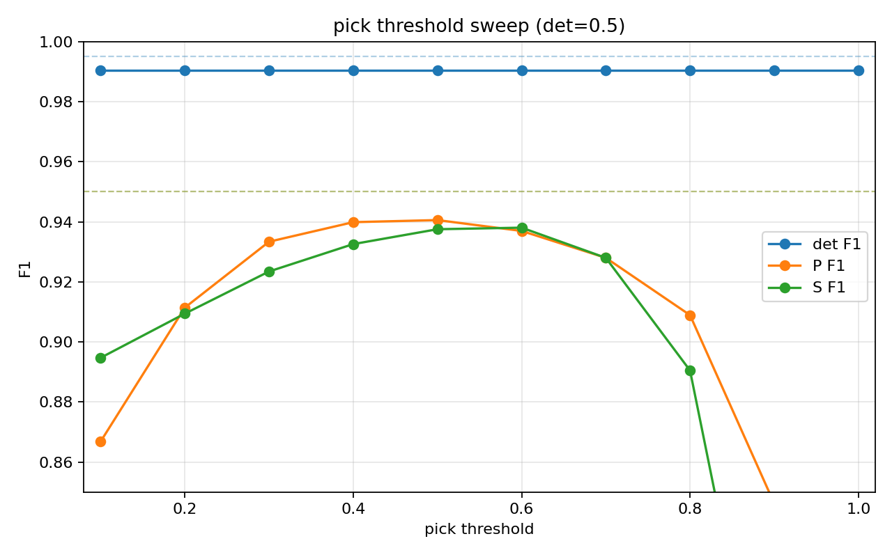

*Figure: detection/P/S F1 as the pick-probability threshold is swept. The plateau
around the operating point shows the picker is not knife-edge sensitive to the
threshold; the chosen value maximizes det-F1 while keeping P/S precision high.*

### OBS transfer (Step 4 + P–S grid)

Protocol (fairness):
- same disjoint holdout (`obs_matched_adapt_split_randoffset`, n=800)
- **separate** zero-shot vs matched light-adapt tables (never mix treatments)
- light-adapt peers share **8 epochs** + same OBS train pool
- pick-only F1, tol=0.5 s, random `p_offset∈[4,12]`
- HNF `seq_len` = resampling of the same 60 s window (disclosed); EQT/PN use native SB length

#### A. Zero-shot (STEAD → OBS)

| Model | P-F1 | S-F1 |
|-------|-----:|-----:|
| HNF(run28/STEAD) | 0.201 | 0.453 |
| EQT(STEAD) | **0.543** | **0.660** |
| PhaseNet(STEAD) | 0.417 | 0.563 |

#### B. Matched light-adapt (same split/epochs → OBS holdout)

| Model | seq_len | P-F1 | S-F1 | score† |
|-------|--------:|-----:|-----:|-------:|
| **HNF(trunk-tail/L1200)** ★ | 1200 | **0.374** | 0.649 | **0.484** |
| HNF(heads+onset/L800) | 800 | 0.302 | **0.702** | 0.462 |
| HNF(trunk-tail/L1600) | 1600 | 0.370 | 0.609 | 0.466 |
| EQT(STEAD+OBS-adapt) | — | **0.589** | **0.745** | 0.651 |
| PhaseNet(STEAD+OBS-adapt) | — | 0.457 | 0.625 | 0.524 |

† score = 0.6·P + 0.4·S with soft floor S≥0.60. ★ = selected HNF under this score.

#### C. Reference only (different budget — do not mix into B)

| Model | P-F1 | S-F1 |
|-------|-----:|-----:|
| HNF(run28/OBS-full) | 0.303 | 0.711 |
| EQT(OBS) / PhaseNet(OBS) full-pretrained | ~0.78 | ~0.49–0.59 |

**Takeaways:** under matched adapt, HNF best **P** is trunk-tail@1200 (0.374) while best **S** remains heads+onset@800 (0.702). EQT still leads the adapt board. Canonical selected ckpt: `outputs/obs_ps_tradeoff_grid/selected_hnf/best.pt`.

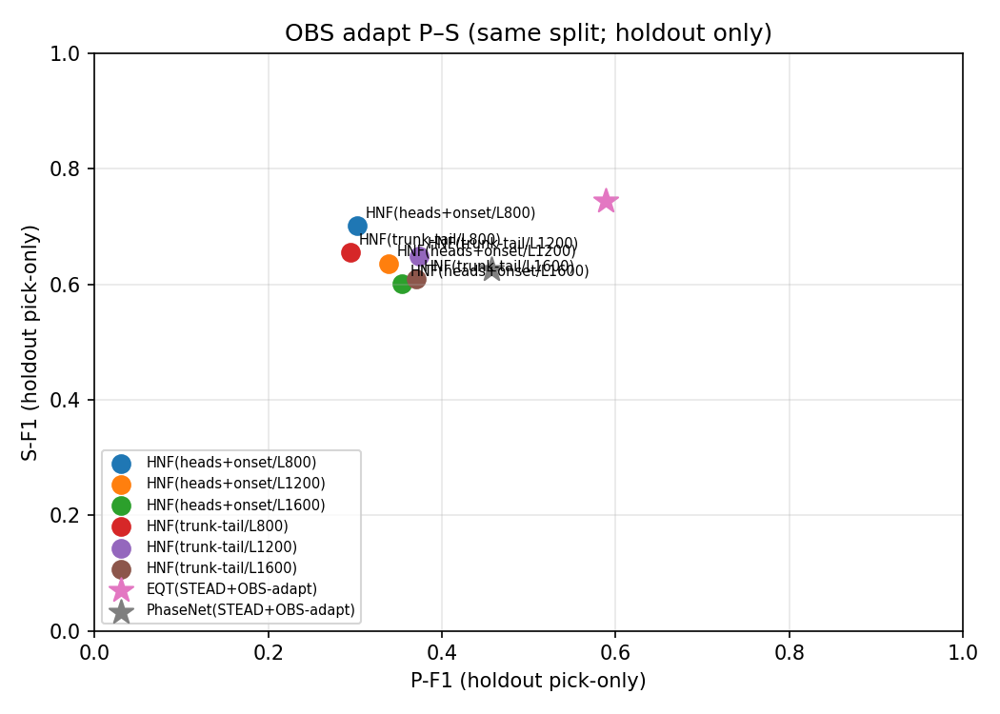

```bash
PYTHONPATH=. python scripts/experiments/run_obs_ps_tradeoff_grid.py --epochs 8 --device cuda
```

### Foveated active perception (archived — not in the main story)

`hnf/foveated/` implements a **智子双中央凹** active-perception loop
(`PeripheralScanner → Scheduler → FoveaProcessor(run28) → CausalMemory → fuse
P/S`) that reads only a few glimpses of each 60 s window. On STEAD it reaches
**P/S ≈ 0.917/0.940 at ~7.4 gazes** (dense run28 baseline 0.954/0.955), but it
does **not** transfer for free — on OBS the glimpse policy underperforms the
dense picker. Kept as an archived capability; reports under
`outputs/foveated/`, figures `docs/figures/foveated_*.png`.

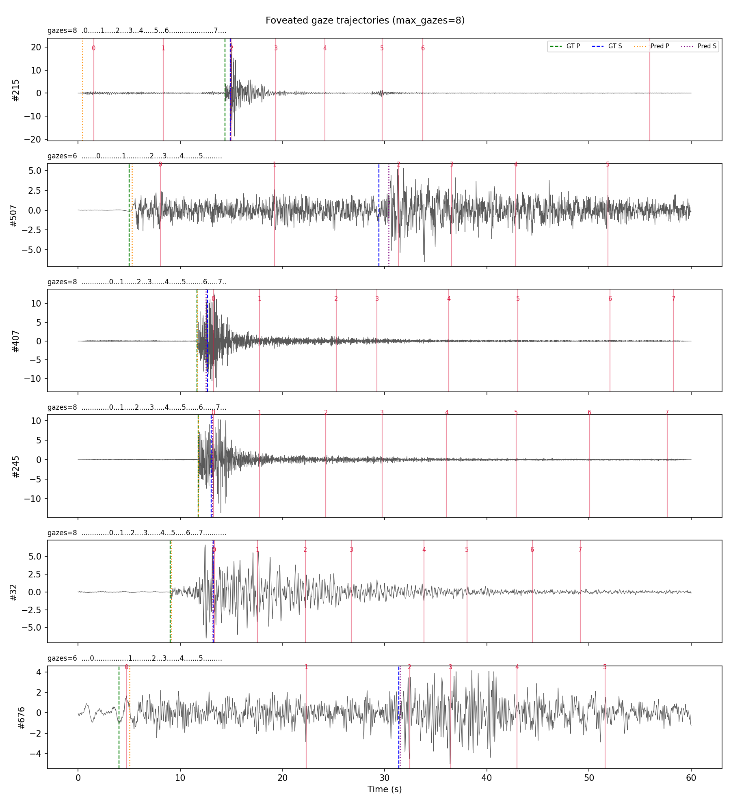

*Figure: gaze centers (red) vs ground-truth P/S (green/blue dashed) and model
predictions (orange/purple dotted); the scheduler concentrates its budget near
the true phase onsets.*

### 1D inversion baselines

| Component | Module |
|-----------|--------|
| Layered Earth + P/S travel times | `hnf/inversion_1d.py` |
| Gauss–Newton / L-BFGS / Adam | `hnf/inversion_baselines.py` |
| Acoustic FWI-lite | `hnf/acoustic_fwi_1d.py` |
| Synthetic waveforms | `hnf/synth_waveforms_1d.py` |
| Ray paths | `hnf/ray_paths.py` |

```bash
python scripts/inversion/run_inv01_synth_1d.py
python scripts/inversion/run_inv_full_compare.py
python scripts/inversion/run_inv_fwi_lite.py
```

**Takeaway:** classical TT solvers reach the lowest absolute Vp RMSE on
synthetic oracles. The Zhizi line targets a **better waveform-inversion
initializer**.

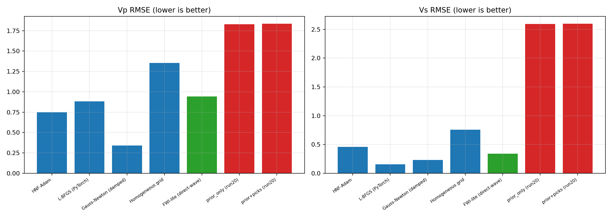

### Physics Decoder

```
Frozen run28 picking backbone
  → rho(t), envelope, kernel soft scales, P/S picks [, kernel_summary γ/ω/c]
  → macro Physics Head: scale / contrast / Vs ratio
  → vp0/vs0 relative to a reference layered model
  → optional waveform refine (Route A2) or travel-time refine
```

Code: `hnf/physics_decoder.py`, `zhizi_physics_head.py`,
`zhizi_inversion_dataset.py`, `zhizi_inversion_loss.py`
(shim: `zhizi_inversion_bridge.py`).

```bash
# Preferred run28 macro (init-focused claim)
python tools/train_zhizi_inversion.py \
  --checkpoint outputs/run28/28_ms_fresnel_phys_20ep/best.pt \
  --head-mode macro --epochs 8 --n-train 96 --n-val 16 \
  --unrolled-weight 0.5 --unrolled-steps 5 \
  --vp-sup-weight 0.05 --lr 3e-3 \
  --output-dir outputs/physics_decoder_run28_macro

# Optional: kernel_summary + weak mid-TT
python tools/train_zhizi_inversion.py ... --kernel-summary --mid-tt-weight 0.08 \
  --output-dir outputs/physics_decoder_run28_macro_ks
```

**Large-N Route A2 (n=256).** The decoder is judged as an **initializer**: how
close its first-guess Vp is (`init VpRMSE`) and how often that beats a perturbed
reference (`init-win`).

| Head | init VpRMSE (Z) | init-win vs perturb |
|------|----------------:|--------------------:|
| **run28 macro** | **0.173** | **40.6 %** |
| perturb baseline | 0.146 | — |

Takeaway: the run28 macro head is a **useful FWI-lite starting point** — its
cold-start Vp is close to a perturbed oracle and wins ~41 % of events outright,
without any waveform iteration. Report: `outputs/route_a2_run28_macro_n256/`.

### Proof suite (large-N)

```bash
python scripts/inversion/run_proof_suite.py --device cuda --max-events 500 --n-synth 128 \
  --checkpoint outputs/run28/28_ms_fresnel_phys_20ep/best.pt \
  --physics-head outputs/physics_decoder_run28_macro/best_physics_head.pt \
  --head-mode macro --output-dir outputs/proof_suite_run28_n500
```

STEAD geom refine (**n=500**): win-rate **69.6%** (PASS vs 65% gate).
Synth wave Z>P: **68%** (n=128). Full JSON: `outputs/proof_suite_run28_n500/proof_report.json`.

### Imaging: synthetic closed loop → real-data profile

```bash
python scripts/inversion/run_phase_e_synth_imaging.py --device cuda --output-dir outputs/phase_e_formal
python scripts/inversion/run_phase_f_stead_profile.py --device cuda --output-dir outputs/phase_f_qc
python scripts/inversion/run_phase_ef_overview.py \
  --phase-e-report outputs/phase_e_formal/report.json \
  --phase-f-report outputs/phase_f_qc/report.json \
  --output-dir outputs/phase_ef_overview
```

| Phase | Highlight |
|-------|-----------|
| E (synth) | marmousi-style mean Vp RMSE **0.851**, coverage / uncertainty maps |
| F (STEAD) | 57/72 QC-kept events; trusted-bin fraction **59.1%** with trust mask |

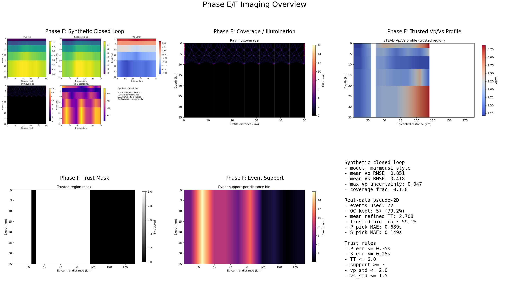

## I.4 Repository layout & short reproduce

```
HNF/
├── hnf/                    # library (kernel, picking, Physics Decoder, …)
├── docs/figures/           # README figures (+ interpret/, probing/, knowledge/)
├── outputs/CURRENT.md      # which dumps are canonical after prune
├── tools/                  # train / eval / download / explain helpers
├── scripts/                # all run_* drivers (see scripts/README.md)
│   ├── experiments/        # run11–run28 numbered picking launches
│   ├── interpret/          # interpret / probing / knowledge mining
│   ├── inversion/          # inv, proof, route A/A2, phase E/F
│   ├── paper/ / picking/ / domain/
└── docs/EXPERIMENT_PLAN.md
```

```bash
CKPT=outputs/run28/28_ms_fresnel_phys_20ep/best.pt
HEAD=outputs/physics_decoder_run28_macro/best_physics_head.pt

python tools/eval_stead_picking.py --checkpoint $CKPT
python scripts/interpret/run_interpret_suite.py --device cuda --checkpoint $CKPT \
  --output-dir outputs/interpret_suite_run28 --copy-to-docs
python scripts/interpret/run_probing_suite.py --device cuda --checkpoint $CKPT --copy-to-docs
python scripts/inversion/run_route_a2_waveform.py --checkpoint $CKPT --physics-head $HEAD \
  --head-mode macro --n-test 256 --output-dir outputs/route_a2_run28_macro_n256
```

---

# II. Interpretability

Two complementary tracks on the **frozen seismic model**:

1. **Parameter interpretability** — does γ, ω, χ, kernel rows, and ρ align with
   wave physics? (largely implemented in `scripts/interpret/run_interpret_suite.py`)
2. **Physical-neuron probing** — treat ρ / K activations as mechanistic units
   and test *causal* decision roles (partially implemented; roadmap below)

```bash
python scripts/interpret/run_interpret_suite.py --device cuda --copy-to-docs \
  --checkpoint outputs/run28/28_ms_fresnel_phys_20ep/best.pt \
  --output-dir outputs/interpret_suite_run28
# → outputs/interpret_suite_run28/interpret_report.json
# → docs/figures/interpret/ (mirrored)
```

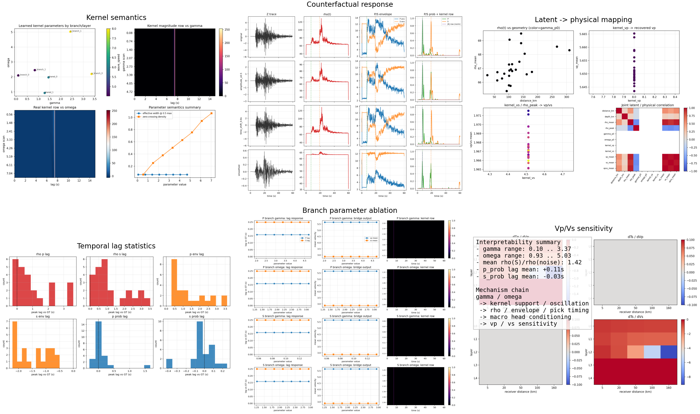

*Figure: γ/ω semantics, counterfactual waveform response, lag stats, branch
ablation, latent→physics mapping, and vp/vs TT sensitivity.*

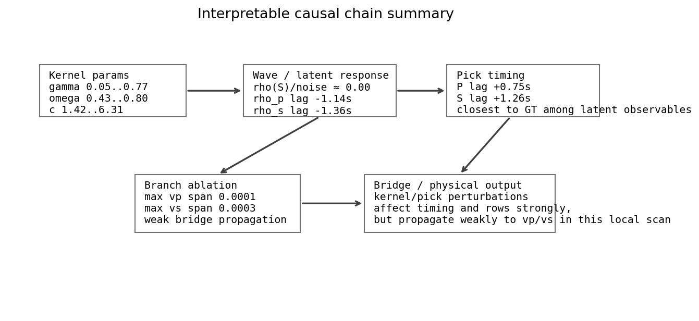

*Figure: evidence is strong on `gamma/omega → kernel → rho/picks`, weaker on
local branch knobs → bridge `vp/vs` under the current macro design.*

## II.1 Parameter interpretability (implemented)

### Kernel physics (Huygens vs Fresnel)

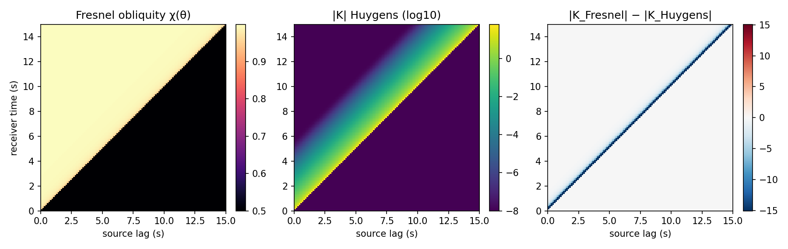

*Figure: the obliquity factor χ(θ) and the resulting Huygens-vs-Fresnel kernel
difference. Fresnel down-weights off-axis (backward) secondary sources, so its
causal rows lean more strongly toward forward propagation.*

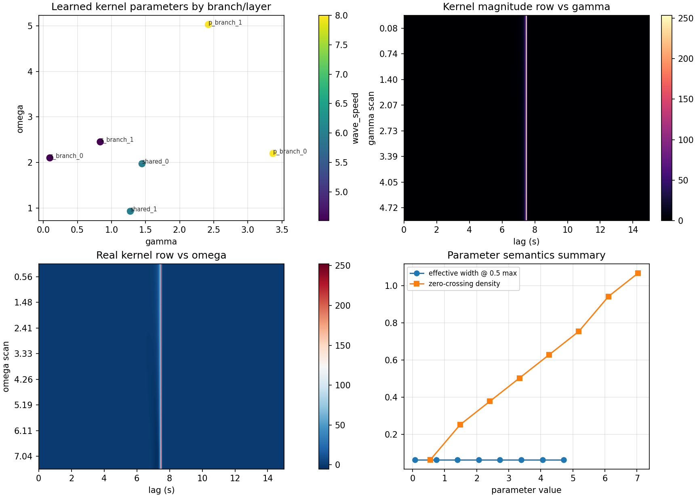

*Figure: sweeping the learned knobs confirms the intended semantics — larger γ
narrows the kernel's support (more local), larger ω adds oscillatory phase.
Learned ranges: `γ ≈ 0.10..3.37`, `ω ≈ 0.93..5.03`, `wave_speed ≈ 4.51..8.00`.*

### Picking explainability

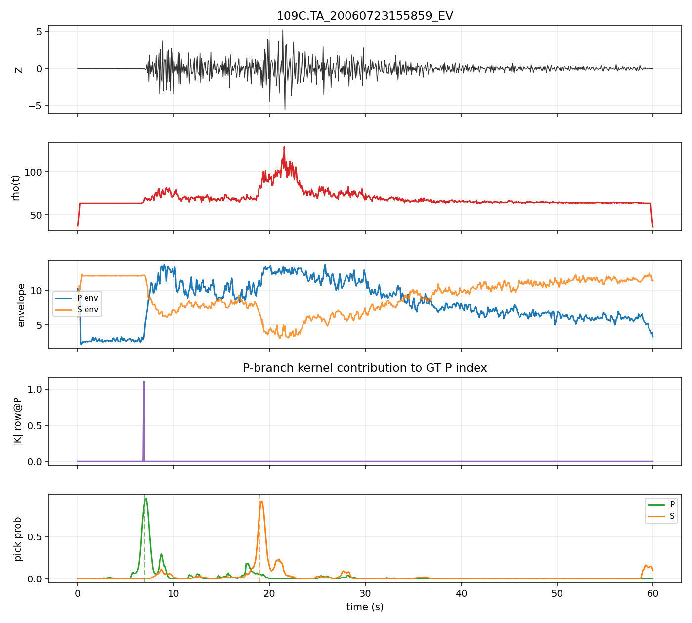

*Figure: at a ground-truth P index, the causal kernel row shows which past
samples the model actually leans on — weight concentrates just before onset,
consistent with a physical arrival rather than a spurious cue.*

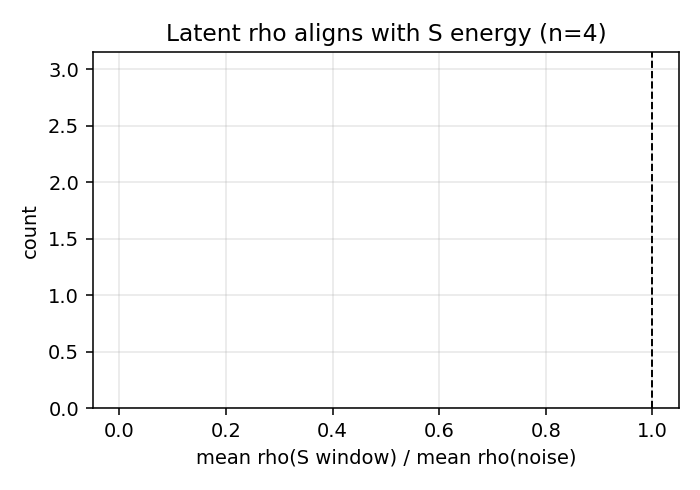

*Figure: the latent weight ρ(t) is systematically higher inside the S window
than in noise, i.e. ρ tracks energetic phases (it is a soft conditioner, not
crustal density).*

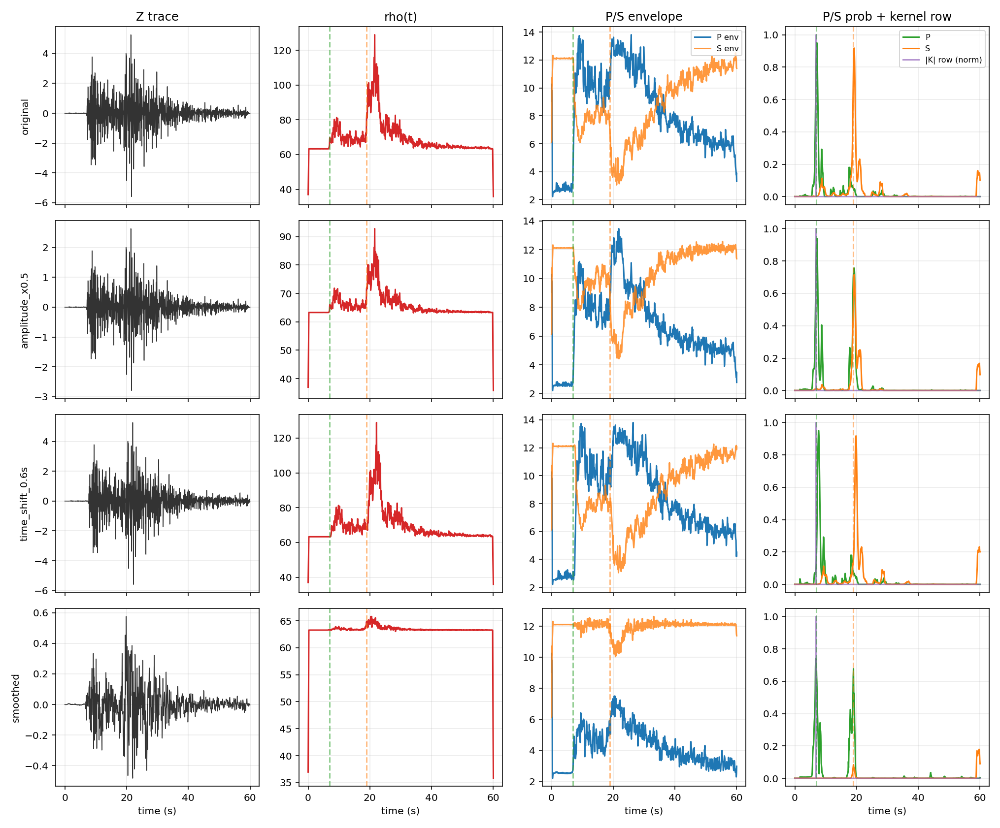

*Figure: editing the input waveform (amplitude vs timing) and reading how picks
move — the model is timing-sensitive at onsets and amplitude-tolerant elsewhere.*

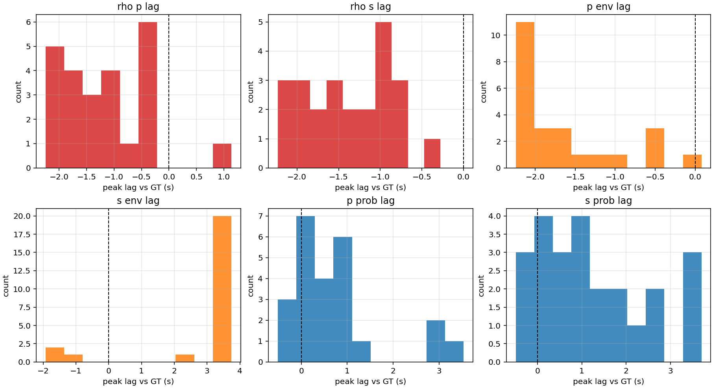

*Figure: distribution of effective causal lags across events — the kernel's
support sits at physically plausible pre-onset offsets.*

### Bridge latents & init→refine

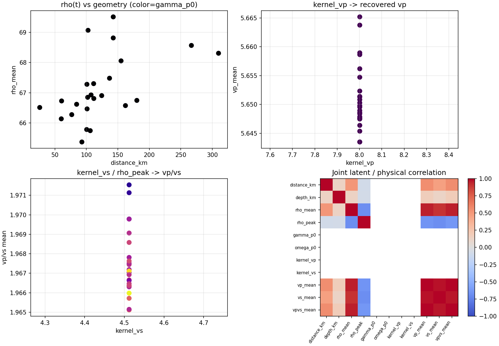

*Figure: how the picking latents map into the Physics-Decoder inputs.*

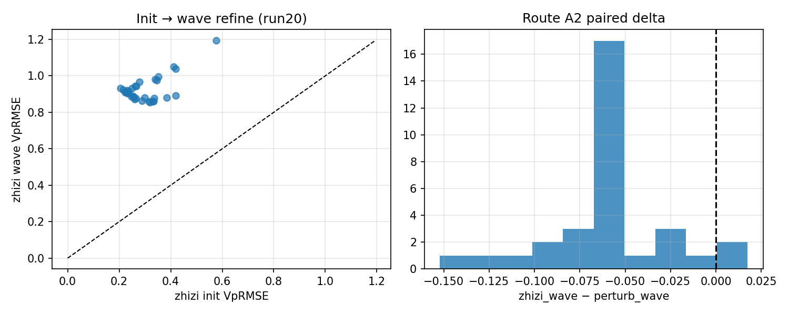

*Figure: the decoder's cold-start Vp (init) vs after optional waveform refine —
the init is already a reasonable profile, which is the FWI-lite claim.*

### Principle ablation (Huygens vs Fresnel)

The design choice — why run28 uses the Fresnel variant — rests on a controlled
ablation of the two kernels under the same recipe:

| Task | Huygens | Fresnel | Verdict |
|------|--------:|--------:|---------|
| Picking det F1 | 0.994 | **0.996** | Fresnel +0.002 |
| Picking P F1 | 0.959 | 0.925 | Huygens +0.034 |
| Picking S F1 | 0.949 | 0.928 | Huygens +0.022 |

Early short-schedule Fresnel trailed on P/S, but the long **run28** schedule
reversed that and now leads on the production picking metrics — hence Fresnel is
the canonical picker.

| Quantity | How to read it |
|----------|----------------|
| `rho(t)` | Soft latent weight; rises with energetic / S intervals — **not** crustal density |
| `gamma` / `omega` | Locality vs oscillation of the causal kernel |
| χ obliquity | Fresnel aperture; forward lags weighted more |
| Kernel row | Which past samples causally contribute to a pick index |
| Counterfactual waveform edits | Amplitude vs timing sensitivity |
| Branch ablation | Local γ/ω → pick lag / kernel shape / weak bridge coupling |

## II.2 Probing “physical neurons”

Script: `scripts/interpret/run_probing_suite.py` → `outputs/probing_suite_run28/` (+
`docs/figures/probing/`).

### (1) Causal-chain tracking **[done — first pass]**

Layer-wise wavefield energy + ρ panels for known events
(`docs/figures/probing/causal_chain/`). Peak-width “sharpening” metric is still
coarse (embed energy is already sparse); qualitative ladders are the keepers.

### (2) Counterfactual ρ scrubbing **[done — first pass]**

Zero / damp ρ near S onset through the forward path. On n=24: **ΔP/ΔS ≈ 0** —
under the current architecture ρ behaves as a **weak conditioner**, not a strong
causal pick switch. Waveform-level counterfactuals in the interpret suite remain
the stronger timing/amplitude evidence.

### (3) Anomaly detection & attribution **[partial]**

False-P-on-noise K-row gallery is implemented; first pass found few high-confidence
false P after thresholding. Re-run with relaxed thresholds when packaging Part II.

```bash
python scripts/interpret/run_probing_suite.py --device cuda --copy-to-docs \
  --checkpoint outputs/run28/28_ms_fresnel_phys_20ep/best.pt \
  --output-dir outputs/probing_suite_run28
```

---

# III. Physics discovery

After interpretability establishes *what internals mean*, discovery asks
*what regularities and transferable physics the trained stack implies*—still
using seismology as the worked example—and how to turn pieces of the network
back into equations / tables.

## III.1 Knowledge mining

Statistical mining over latents, kernel knobs, geometry, and physics outputs
along the mechanism chain
`gamma/omega → kernel → rho/picks → macro → vp/vs`
(with bootstrap / FDR / cross-head stability). Methodology:
[`docs/KNOWLEDGE_MINING.md`](docs/KNOWLEDGE_MINING.md).

```bash
python scripts/interpret/run_knowledge_mining.py
python scripts/interpret/run_knowledge_mining_cross.py   # outputs/knowledge_mining_v4
```

Key keepers / cautions:

- `noise_ratio → pick_err_p` is global, head-independent, and geo-confirmed
- `rho_p_lag → init_tt` transfers across physics heads and survives geo controls
- `rho_mean → vp_mean` is descriptive only (sign flips across heads)
- Direct event-wise `gamma/omega → vp/vs` is **not** appropriate: those knobs
  are global branch parameters in the current model

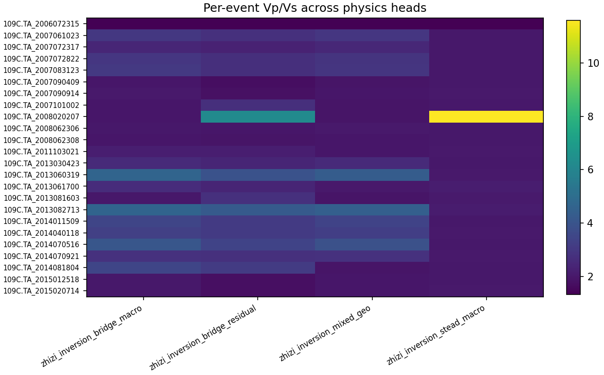

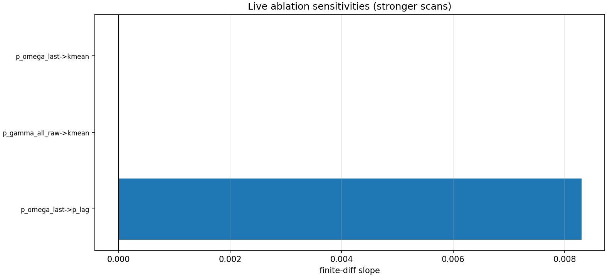

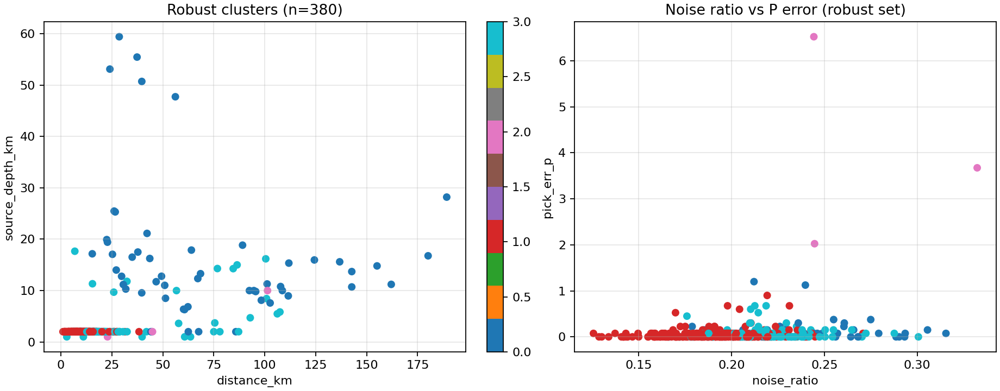

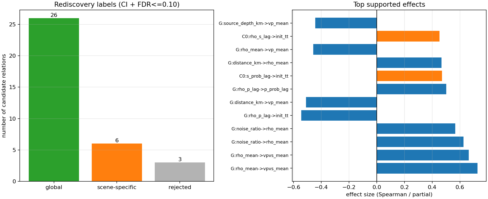

Paper-scale boards (SNR / Ambon / OBS / Fig1 / Fig4 / attributes) are summarized
in [`docs/PAPER_ROADMAP.md`](docs/PAPER_ROADMAP.md) with figures under
`docs/figures/`.

### STEAD in-domain benchmark vs EQTransformer / PhaseNet

Head-to-head on the STEAD EQTransformer test split — **tol=0.5 s**, pick_th=0.3,
det_th=0.5. Hard metrics: det/P/S F1 and pick MAE in seconds.

#### Full test (n=126566 — canonical)

| Model | det F1 | P F1 | S F1 | P MAE | S MAE |
|-------|-------:|-----:|-----:|------:|------:|
| **HNF (run28)** | 0.9986 | 0.9842 | **0.9756** | **0.021** | 0.088 |
| EQTransformer | **0.9989** | **0.9897** | 0.9731 | 0.046 | 0.088 |
| PhaseNet | 0.9969 | 0.9512 | 0.9618 | 0.072 | **0.080** |

Artifact: `outputs/paper_stead_full_test_compare/stead_full_test_compare.md`.
Launcher: `scripts/paper/run_stead_full_test_compare.py`.

**How to read it:** F1 is neck-and-neck with EQT; HNF’s standout is **P-wave timing**
(**21 ms MAE** vs EQT 46 ms / PhaseNet 72 ms). S MAE is similar to EQT; PhaseNet
is slightly better on S MAE at the cost of lower P F1.

#### Subset sanity (10k events + 2k noise — precision/recall detail)

| Model | det F1 (P/R) | P F1 (P/R) | S F1 (P/R) | P MAE | S MAE |
|-------|-------------:|-----------:|-----------:|------:|------:|
| **HNF (run28)** | **0.9986** (0.9995/0.9977) | 0.9842 (0.9949/0.9738) | **0.9756** (0.9892/0.9624) | **0.021** | 0.088 |
| EQTransformer† | 0.9990 (0.9992/0.9989) | **0.9892** (0.9993/0.9794) | 0.9725 (0.9994/0.9470) | 0.046 | 0.089 |
| PhaseNet† | 0.9972 (0.9969/0.9975) | 0.9517 (0.9984/0.9093) | 0.9620 (0.9982/0.9283) | 0.074 | **0.081** |

† Subset from `outputs/paper_stead_triple_compare_50ep/` (same protocol, faster iteration).

**Protocol note:** tol=0.5 s is the standard STEAD/EQT window. Tightening to 0.3 s
barely moves HNF P F1 (P MAE ~21 ms ≪ 300 ms); S F1 drops ~1–2% uniformly across models.

## III.2 Absolute-geography rediscovery

Attaching source/receiver lat–lon (`run_paper_geo_rediscovery.py`,
`run_paper_geo_confirm.py`) shows absolute geography carries signal, but mostly
as **regional / network structure** (ZQ-dominated sample), not a universal
latitude law.

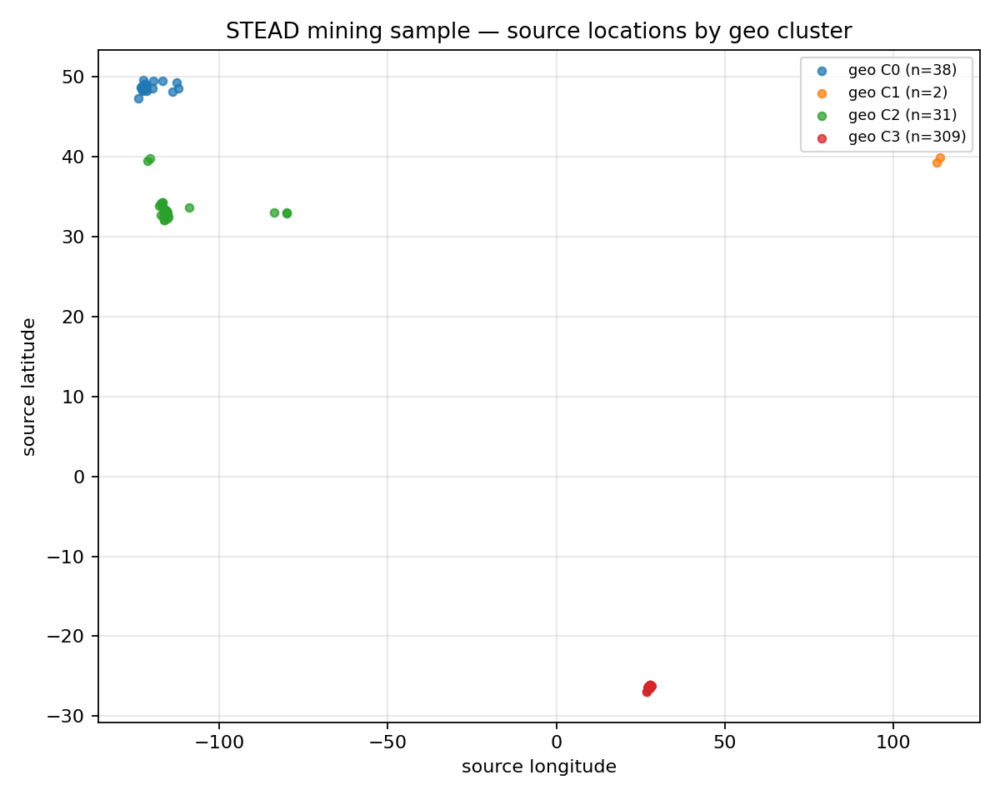

*Figure: event clusters plotted on absolute lat–lon — structure is spatially
coherent but tracks regions/networks rather than a smooth latitude gradient.*

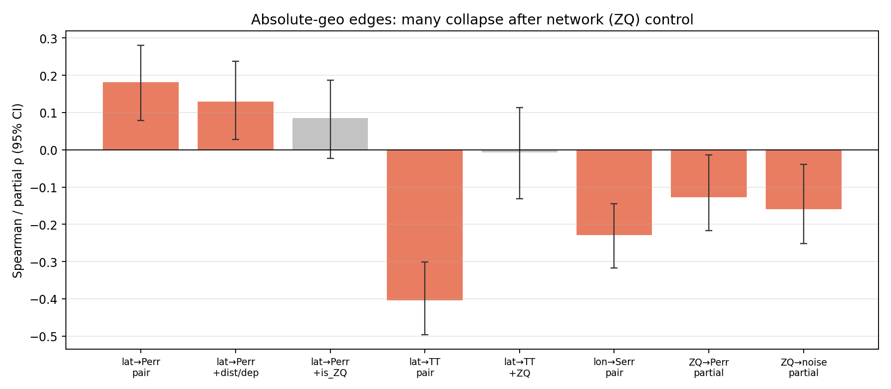

*Figure: apparent latitude→error effects (left) mostly collapse once the network
indicator `is_ZQ` is controlled (right) — a caution against over-reading raw
geography.*

Confirmed (strong): `noise_ratio → pick_err_p` and `rho_p_lag → init_tt`
survive lat/lon **and** `is_ZQ`. Pairwise latitude→error edges often **collapse**
after network control — control `is_ZQ` (or equivalent) before claiming geo laws.

## III.3 Causal-chain modes + interpretable magnitude / structure

**Canonical picker for this analysis:** run28 @ 800
(`outputs/run28/28_ms_fresnel_phys_50ep_local/best.pt`). Any other sample rate
should be resampled to 800 before picking; task metrics are compared in seconds
against EQT@6000 on the same traces (fair end-task compare).

Scalar summaries (det / P-peak / P–S gap) mostly rediscover distance and SNR.
The Huygens stack also exposes **time-resolved** observables — `ρ(t)`,
P/S field envelopes — in a **causal reference frame** (P at τ=0, S at τ=1).
Clustering *shape* (distance factored out) yields mechanism modes; combining
with raw amplitude yields a 2-D `shape×strength` taxonomy for magnitude and
geography.

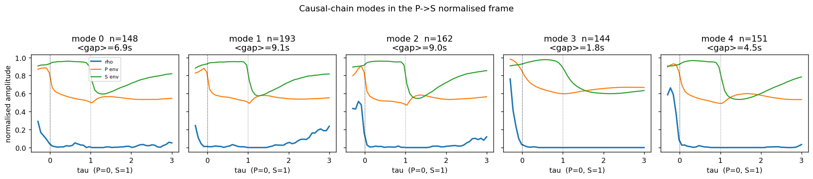

*Figure: waveforms re-expressed in the causal P→S frame, then clustered by shape.
Modes separate along physically named axes — onset sharpness, coda decay slope,
and ρ secondary peaks (multipath) — rather than by raw distance.*

| Module / tool | Role |
|---------------|------|
| `hnf/causal_chain.py` | Causal-frame resample, shape features, raw-amplitude Richter proxies |
| `hnf/kernel_response.py` | Per-trace kernel-*row* summaries (ρ-modulated; **not** global γ/ω/c) |
| `tools/build_causal_chain_library.py` | Induce causal modes + cross-tab vs summary clusters |
| `tools/reclassify_causal_physics.py` | Shape / shape+kernel / full interpretable taxonomies |
| `tools/interpretable_ceiling.py` | Site/depth/SNR/path + ml/md + `shape×strength` |
| `logs/run_interpretable_physics_suite.sh` | One-shot best suite → `outputs/interpretable_physics_best/` |
| `hnf/pattern_library.py` | **Routing only**: cheap summary features (det/ρ/gap) — no causal chain, no γ/ω/c |

**Two-tier design.** (1) Router pattern library stays on light summaries for
skip/crop. (2) After a valid P/S chain exists, interpretability uses causal-chain
shape **plus** per-trace kernel-row responses (mean lag / spread / entropy at P
and S). Global γ/ω/c are checkpoint constants and are never used for clustering.

```bash
# recommended: full suite (GPU for feature extract; ceiling is CPU)
bash logs/run_interpretable_physics_suite.sh
# artifacts: outputs/interpretable_physics_best/{causal_chain,reclass,ceiling,MASTER_REPORT.md}
```

**Taxonomy.** Prefer 2-D `shape×strength` (data-driven thresholds on the slice):

- **shape** (path / mechanism): `impulsive_fastQ` / `emergent` / `multipath` /
  `slow_coda` / `standard` — onset sharpness, coda slope, ρ secondary peaks
- **strength** (source): `weak` / `mid` / `strong` — terciles of
  `reduced_amp = log₁₀A + log₁₀D` on the *unnormalised* STEAD waveform

Reclass also reports a **`shape_plus_kernel`** k-means view that appends
per-trace kernel-row summaries (mean lag / spread / entropy at P and S). That
captures how ρ modulates the causal band — still not the global γ/ω/c knobs.

**Magnitude (single-station, interpretable).** Best suite on **n=1496** val events
(`outputs/interpretable_physics_best/`):

| Model | R² | MAE |
|-------|---:|----:|
| Richter `logA+logD` | 0.725 | — |
| + station/network site terms | 0.828 | — |
| + depth/SNR + site | 0.838 | — |
| + coda path residual + site | 0.862 | — |
| **ml/md stratified phys+path+site** | **0.880** | **0.26** |

Each row is a fully interpretable regression whose form is a Richter-style law,

\[
M \approx a\log_{10}A + b\log_{10}(D+1) + c + s_{\mathrm{station}},
\]

progressively adding named terms (station/network site, depth, SNR, a
distance-detrended coda-path residual). Reading down the table, physical terms
climb from a bare amplitude/distance law (R²≈0.73) to **R²≈0.88 / MAE 0.26**.
Site tables: `ceiling/site_terms.csv`, `ceiling/network_terms.csv`; note:
`ceiling/INTERPRETABILITY.md`.

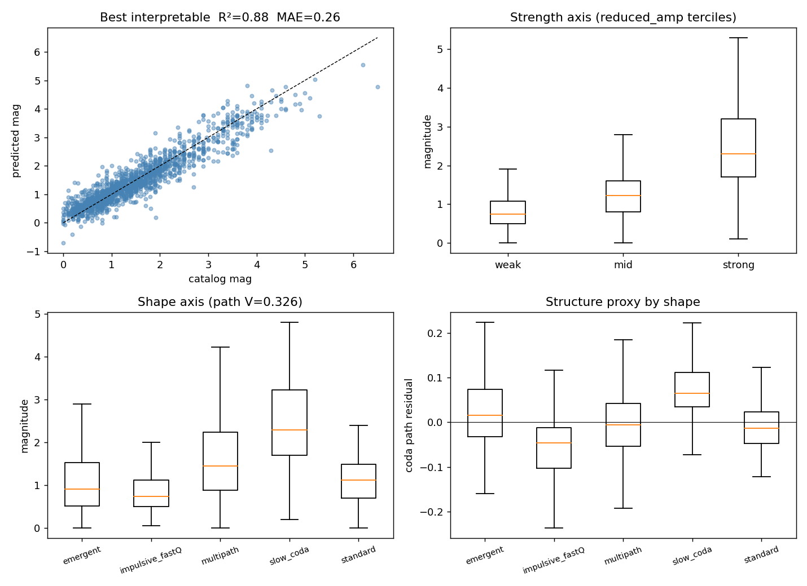

*Figure: predicted vs catalog magnitude and the term-by-term R² ladder. The
single-station interpretable ceiling saturates around **0.83–0.88 R²** — **0.95
is not a realistic KPI** without multi-station stacks or a unified magnitude
scale. Causal **shape** is the lever for path/structure, not for pushing this R².*

**Geography / structure** (same slice):

- shape ↔ path-region Cramér's V ≈ **0.33** (0–50 km controlled ≈ **0.34**)
- shape ↔ source-region V ≈ **0.33**
- reclass k-means path V: `shape_only` ≈ **0.27**, `shape_plus_kernel` ≈ **0.22**,
  `full_interpretable` ≈ **0.26** — kernel rows refine mechanism clusters but do not
  beat pure shape on geography alone
- coda path residual (Cohen's *d* vs rest): `impulsive_fastQ` ≈ **−0.82**
  (faster decay; concentrated near +35/−125); `slow_coda` ≈ **+1.19**
  (slower decay; enriched near +15/−160 and +30/−120)

## III.4 Reparameterization → physical equations

Discovery is not only correlation tables. A parallel track **reparameterizes**
trained internals into analytic or classical forms that can be compared to
textbook Earth / wave models. Status: mostly **planned**, building on existing
exports.

### (1) Analytic medium parameters **[done — first pass]**

Fit learned ρ-field summaries with spatial analytic functions (polynomials in
epicentral distance). Hook: `scripts/interpret/run_reparam_suite.py`
→ `outputs/reparam_suite_run28/analytic_medium_distance_fits.png`.

### (2) Reverse-engineer empirical velocity models **[done — first pass]**

Compare Physics Decoder layered `vp/vs` to classical **AK135** (Ambon table).
Artifact: `outputs/reparam_suite_run28/velocity_residual_vs_classical.png`.

### (3) Operator simplification (low-rank K) **[done — first pass]**

SVD of causal kernel magnitude matrices; report cumulative energy and
reconstruction error at ranks 1/2/4/8.

```bash
PYTHONPATH=. python scripts/interpret/run_reparam_suite.py \
  --checkpoint outputs/run28/28_ms_fresnel_phys_20ep/best.pt \
  --physics-head outputs/physics_decoder_run28_macro/best_physics_head.pt \
  --compare ak135 --svd-ranks 1,2,4,8 \
  --output-dir outputs/reparam_suite_run28
```

---

# IV. Generalization

Parts I–III define a reusable research pattern on seismology. Domain transfer
asks whether the **same pattern**—sparse observation → HNF encoder → task head
/ Physics Decoder → interpretability → mining—holds outside earthquakes.

| Pattern step | Seismology (Domain I) | EEG (Domain II) | Fluid (Domain III) |
|--------------|----------------------|-----------------|--------------------|
| Sparse observation | 3C waveforms | multi-channel EEG | sparse **3D/4D** flow voxels |
| Encoder | HNF picking backbone | HNF EEG encoder | **3D spatial HNF** (+ ω-DOF) |
| Physics / task head | picks + vp/vs | disease / state head | constitutive (η, λ, …) |
| Interpretable unit | ρ(t), γ, ω, K rows | ρ(t) / spectral proxies | **ρ(x,y,z), γ, vort/mom sources** |
| Discovery | geo + velocity residuals | group contrasts / ROC | residual vs base rheology |

## IV.1 Domain II — AD/FTD EEG (anisotropic diffusion HNF)

**Preferred checkpoint (classification):**  
`outputs/eeg/aniso_diffusion_ablation/phase_off/best.pt`  
— EEG-native HNF with **anisotropic diffusion** spatial/temporal kernels and
**no rhythm phase** on the Green kernel (`--principle aniso_diffusion --no-rhythm-phase`).  
Clinical suite: `outputs/eeg/aniso_diffusion_ablation/phase_off_clinical/`.  
Figures: `docs/figures/eeg/aniso_*.{png,pdf}`. Interpretability dump:
`outputs/eeg/aniso_interpret/`.

**Kernel (conceptual).** Secondary sources mix via an anisotropic heat kernel

\[
K(\Delta x,\tau)\propto(\det D)^{-1/2}\,\tau^{-d/2}
\exp\!\bigl(-\Delta x^{\mathsf T} D^{-1}\Delta x/(4\tau)\bigr)
\]

with learnable SPD \(D\) on 10–20 electrode XYZ (spatial) and lag-\(\tau\) diffusion
in rhythm branches (temporal). Ablation: adding oscillatory \(\mathrm{e}^{\mathrm{i}\omega\tau}\)
**hurts** held-out discrimination → preferred model is amplitude-only diffusion.

| Piece | Location |
|-------|----------|
| Dataset | `hnf/eeg_dataset.py` (OpenNeuro ds004504; HC/FTD/AD; Age/Gender/MMSE) |
| Model | `hnf/eeg_native_model.py` (`SpatialAnisoDiffusionMix` + δ/θ/α branches) |
| Kernel | `hnf/kernel.py` (`principle=aniso_diffusion`, `rhythm_phase`) |
| Train | `tools/train_eeg_native.py --principle aniso_diffusion --no-rhythm-phase` |
| Clinical suite | `tools/run_eeg_clinical_suite.py` |
| Paper figures | `tools/plot_eeg_aniso_paper_figures.py` |
| Explain / chain / cards | `tools/explain_eeg_native.py`, `build_eeg_temporal_chain_library.py`, `build_eeg_knowledge_cards.py` |
| **Literature SOTA** | Braindecode EEGNetv4 / ShallowFBCSP / Deep4Net / EEGConformer |

```bash
# Preferred recipe
PYTHONPATH=. python tools/train_eeg_native.py \
  --principle aniso_diffusion --no-rhythm-phase --mmse-weight 0.1 \
  --no-subject-balanced --no-synthetic \
  --output-dir outputs/eeg/aniso_diffusion_ablation/phase_off
# Clinical + paper figures + discovery
PYTHONPATH=. python tools/run_eeg_clinical_suite.py \
  --checkpoint outputs/eeg/aniso_diffusion_ablation/phase_off/best.pt \
  --output-dir outputs/eeg/aniso_diffusion_ablation/phase_off_clinical --no-synthetic
bash logs/run_eeg_aniso_interpret.sh
```

**Data.** 88 subjects (AD 36 / HC 29 / FTD 23); subject-level split seed=42
(train 57 / val 13 / test 18). Epochs: 19ch × 10 s @ 128 Hz.

### vs literature SOTA (aniso only)

Same subject split. Braindecode models: val macro-AUC grid (30 ep) → retrain 50 ep
(`outputs/eeg/adftd_braindecode_sota/`). In-house EEGNet/Conformer similarly tuned
(`outputs/eeg/adftd_sota_tuned/`).

**Held-out test (n=18)**

| Model | subject acc | AD↔FTD acc | macro-AUC | params |
|-------|------------:|-----------:|----------:|-------:|
| **HNF aniso diffusion (phase_off)** | **0.833** | **0.769** | **0.917** | 105k |
| EEGNetv4 (Braindecode) | 0.722 | 0.692 | 0.780 | 3.3k |
| EEG Conformer (Braindecode) | 0.667 | 0.692 | 0.773 | 969k |
| Deep4Net (Braindecode) | 0.611 | 0.462 | 0.811 | 282k |
| ShallowFBCSPNet (Braindecode) | 0.556 | 0.385 | 0.828 | 41k |

**Val+test pool (n=31)** — larger evaluation set; train excluded
(`outputs/eeg/valtest_pool_eval/VALTEST_POOL_BOARD.md`):

| Model | subject acc | AD↔FTD | subject AUC |
|-------|------------:|-------:|------------:|
| **HNF aniso diffusion** | **0.774** | **0.773** | **0.858** |
| EEGNet (in-house tuned) | 0.677 | 0.636 | 0.808 |
| EEGNetv4 (Braindecode) | 0.645 | 0.591 | 0.757 |
| EEG Conformer (Braindecode) | 0.613 | 0.636 | 0.745 |
| Deep4Net | 0.548 | 0.455 | 0.725 |

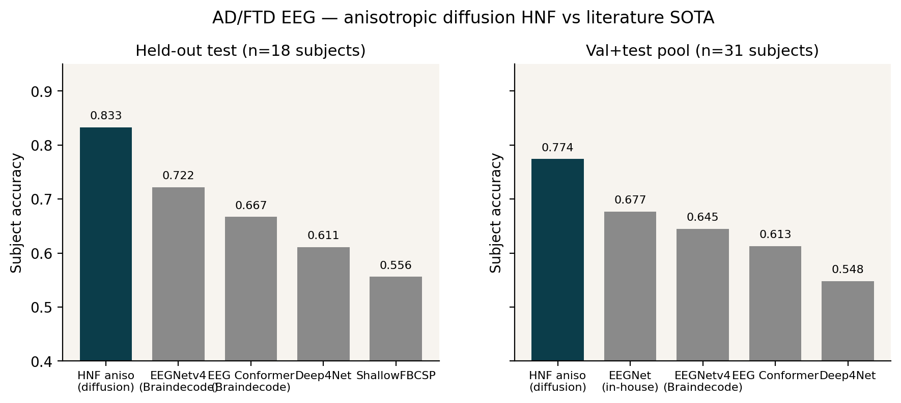

*Figure: anisotropic diffusion HNF vs literature / Braindecode SOTA under two
evaluation protocols (test n=18; pooled val+test n=31).*

**Journal summary figure (classification + biomarker):**

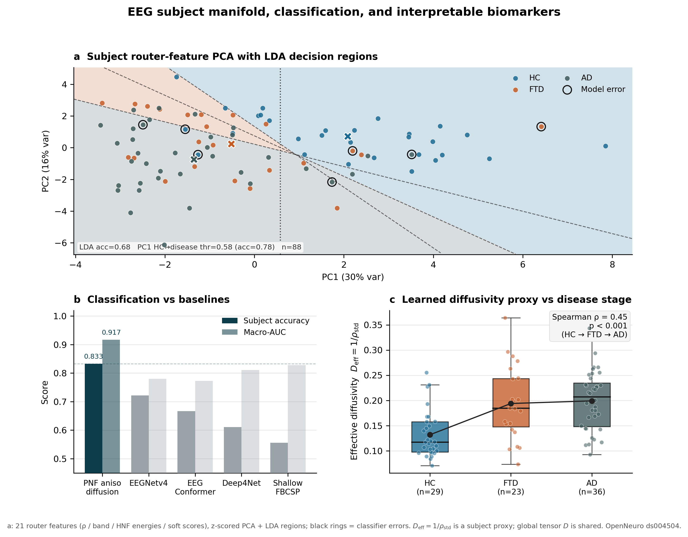

*Figure: EEG classification and interpretable biomarkers.
**a** Subject accuracy and macro-AUC versus Braindecode / literature baselines
(held-out test, n=18).
**b** Subject-level effective diffusivity \(D_{\mathrm{eff}}=1/\rho_{\mathrm{std}}\)
increases along HC→FTD→AD (Spearman ρ=0.45, **p<0.001**), consistent with reduced
PNF medium-density dynamics (and reduced neural synchrony) in AD.
Note: \(D_{\mathrm{eff}}\) is a per-subject proxy from ρ dynamics; the shared SPD
tensor \(D\) in the kernel is global.*

**Phase ablation (same aniso backbone):** phase_off subject acc **0.833** vs
phase_on **0.667** on test — rhythm phase on the diffusion kernel is **not** helpful;
δ/θ/α branches already carry band structure.

### Clinical increment (aniso phase_off)

| Metric | Value |
|--------|------:|
| Test subject acc / AD↔FTD | 0.833 / 0.769 |
| MMSE ΔR² (Age+Gender → +EEG) | 0.294 |
| AD vs rest AUC (demo → +EEG) | 0.639 → 0.805 |
| Train FDR marker hits (BH) | 15 (ρ family dominant) |
| Test FDR confirmations | 0 (small-N; discovery still provisional) |

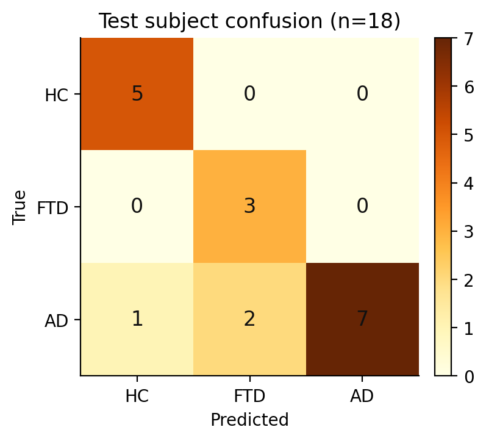
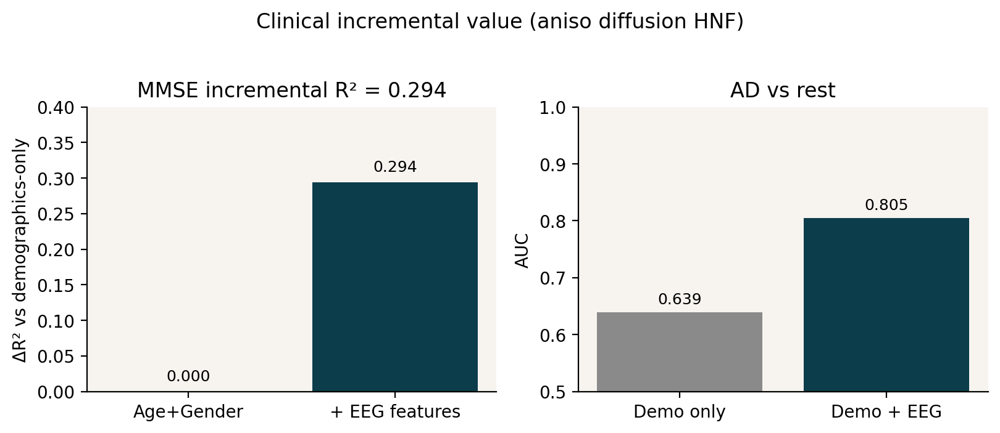

*Figures: held-out subject confusion; demographics-controlled MMSE / AD-vs-rest
incremental value.*

### Interpretability & physics discovery

1. **Learned anisotropy \(D\)** — SPD tensor on the scalp; eigenvalue spread
   encodes preferred conduction directions (not isotropic 10–20 mixing).
2. **ρ(t) medium density** — train FDR hits concentrate on `rho_std` / `rho_p90` /
   `rho_cv`: HC shows **larger ρ dynamics** than AD/FTD.
3. **Single-epoch explain** — waveform, ρ(t), δ/θ/α envelopes, regional energies.
4. **Temporal-chain modes** — early→late + θ→α propagation clusters (shape library).
5. **Subject-level router clusters** — ρ / band / HNF energies for pattern routing.

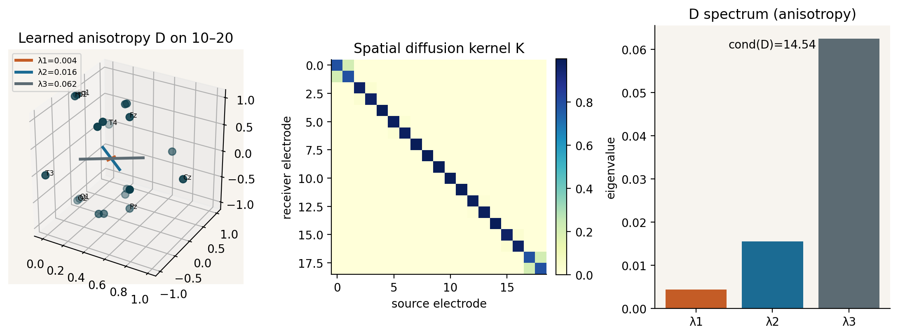

*Figure: learned diffusion tensor principal axes on 10–20 electrodes, spatial
kernel matrix \(K\), and \(D\) eigenvalue spectrum.*

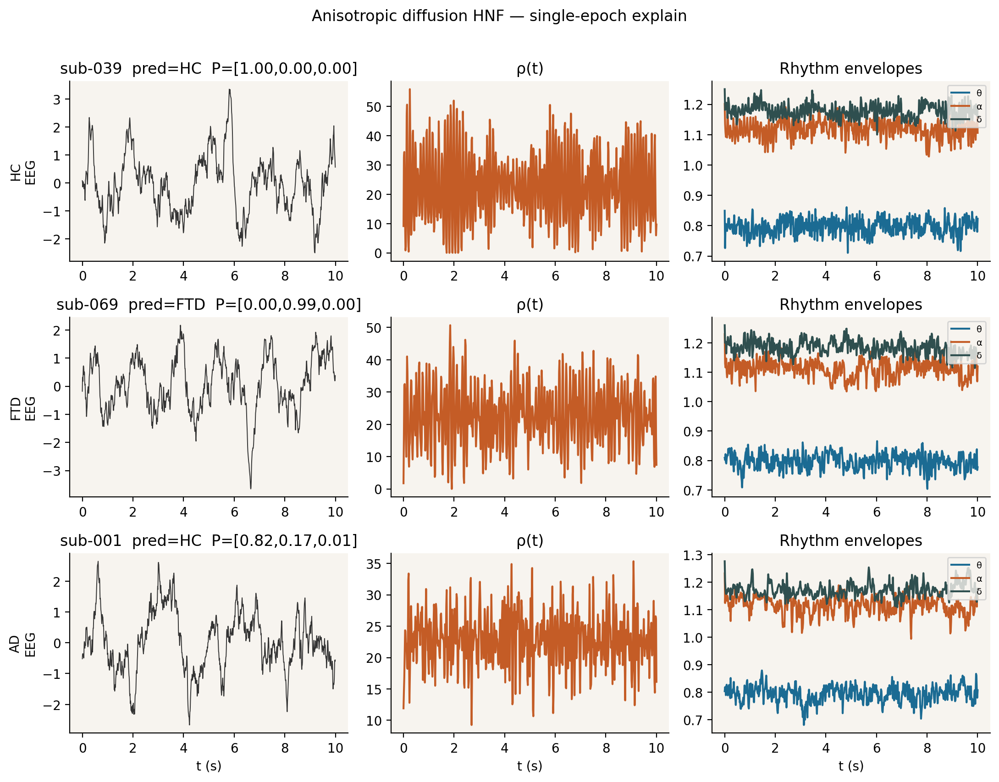

*Figure: HC / FTD / AD test epochs — mean EEG, ρ(t), and rhythm-branch envelopes
under the anisotropic diffusion backbone.*

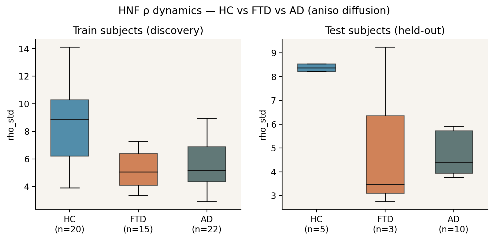

*Figure: subject-level ρ dynamics by clinical group (train discovery vs held-out test).*

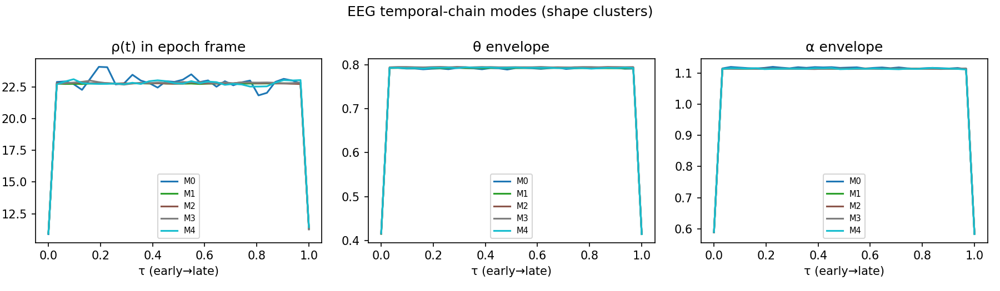

*Figure: K-means shape modes in the epoch early→late / θ→α frame under aniso HNF.*

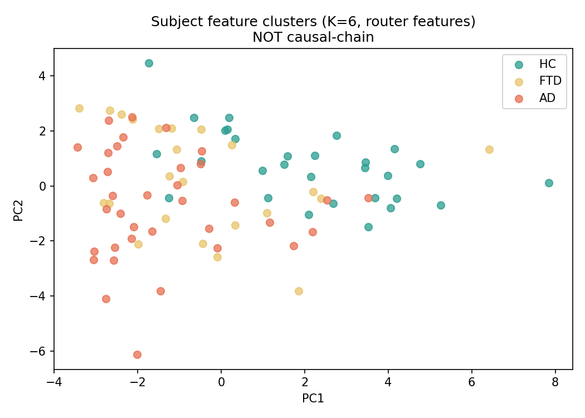

*Figure: subject-level clusters on router features (ρ, band power, HNF energies).*

Knowledge cards: `outputs/eeg/aniso_interpret/knowledge_cards/KNOWLEDGE_CARDS.md`
(15 train-FDR hits; ρ family + classical θ/α).  
Marker stability: `outputs/eeg/aniso_interpret/marker_stability/marker_stability.md`.

### Publishability snapshot (honest)

| Track | Claim | Caveat |
|-------|-------|--------|
| EEG vs literature SOTA | Aniso HNF leads subject acc / macro-AUC on ds004504 | Single site, N_test=18 |
| Kernel design | Anisotropic diffusion > oscillatory phase on this task | Pilot ablation |
| Biomarker direction | ρ dynamics HC > disease (train FDR) | Test FDR not yet confirmed |
| Clinical increment | MMSE ΔR²≈0.29; AD-vs-rest AUC↑ with EEG | Not a diagnostic device claim |

**Claim discipline:** aiming for breakthrough help; **not** claiming clinical
deployment readiness. External replication and multi-site transfer remain open.


## IV.2 Domain III — sparse 3D/4D flow → constitutive discovery

**Status:** Stage-0c **3D/4D spatial HNF** suite **complete** (2026-07-27): synth 3D/4D + RACLETTE 3D +
baseline & literature-SOTA comparison + interpretability figures.

### Stage-0c — 3D/4D spatial Huygens

Upgraded from 2D slices to **volumetric (vx, vy, vz)** with vector vorticity ω and
Biot–Savart secondary sources on a 3D stencil; **4D** adds per-voxel temporal Conv1d
over cardiac phase (T=4). Full suite: [`outputs/fluid/spatial_3d4d_suite/SUITE.md`](outputs/fluid/spatial_3d4d_suite/SUITE.md).

| Task | Grid | HNF test vel_rel | Notes |
|------|------|-----------------:|-------|
| all families | 12³ | **0.41** | pipe 0.21, shear 0.12, vortex 0.92 |
| vortex_tube only | 12³ | **0.32** | vs 2D spatial **0.85**, raster **0.87** |
| 4D synth | 8×12×12×T=4 | **0.67** | pipe 0.29 ✓, advecting_vortex 1.00 ✗ |
| RACLETTE 3D | real volumes | **1.19** | inside-vessel 1.05 — needs more tuning |

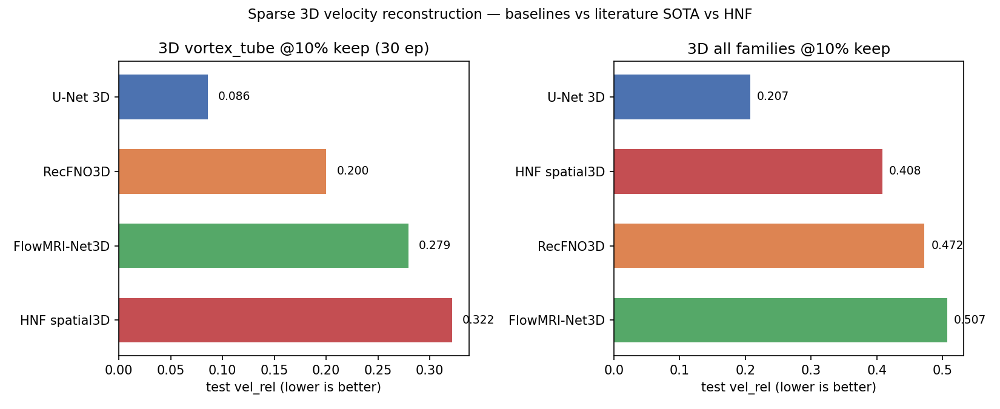
*Figure: sparse 3D reconstruction — U-Net baseline vs literature SOTA (RecFNO, FlowMRI-Net) vs HNF.*

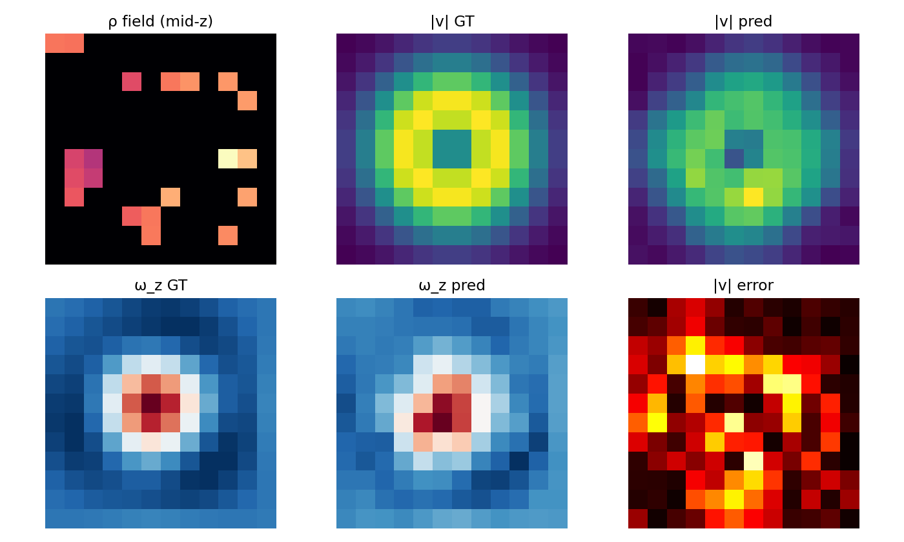
*Figure: mid-z slice — ρ field, |v| GT/pred, ω_z, error (vortex_tube checkpoint).*

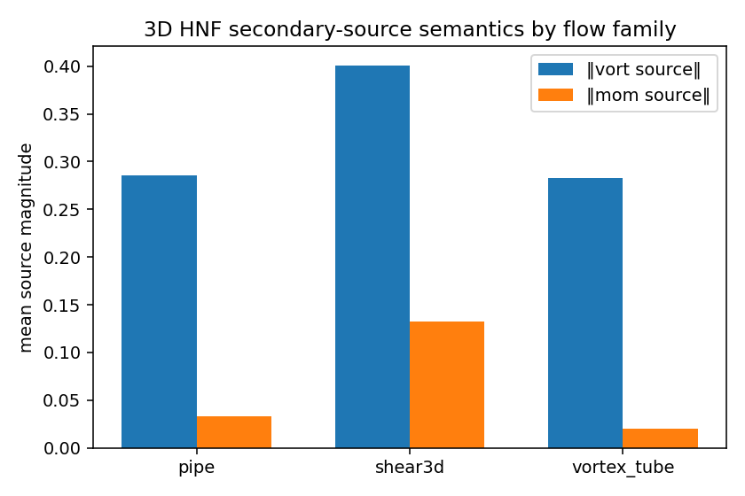
*Figure: learned secondary-source magnitudes by flow family (mom vs vort DOF).*

### vs baselines & literature SOTA (@10% sparse keep, synthetic)

Same 30-epoch budget on synthetic 12³ grids. **U-Net / CNN-AE** are standard baselines;
**RecFNO** (Zhao et al., 2023) and **FlowMRI-Net** (Wallerberger et al., 2025) are recent
literature methods adapted to our grid sparse-velocity task (FlowMRI-Net uses a simplified
unrolled grid variant; the paper's full model operates in k-space).

| Model | type | vortex_tube vel_rel | all-families vel_rel | params |
|-------|------|--------------------:|---------------------:|-------:|
| 3D U-Net | baseline | **0.086** | **0.207** | 3.15M |
| 3D CNN-AE | baseline | 0.094 | — | 936K |
| **RecFNO3D** | lit. SOTA | **0.200** | 0.472 | 313K |
| **FlowMRI-Net3D** | lit. SOTA | 0.279 | 0.507 | **19K** |
| **HNF spatial3D+rot** | ours | 0.322 | 0.409 | 71K |
| HNF spatial2D+rot | ours | 0.852 | 0.426 | ~65K |

**4D synth** (8×12×12, T=4, 40 ep HNF / 30 ep U-Net):

| Model | vel_rel | pipe | advecting_vortex |
|-------|--------:|-----:|-----------------:|
| U-Net 4D (baseline) | **0.39** | 0.10 | 0.59 |
| HNF spatial4D | 0.67 | 0.29 | 1.00 |

**Takeaway:** U-Net still wins raw error on this budget. Among **literature SOTA**, RecFNO
beats HNF on vortex-only (0.20 vs 0.32); HNF wins on **multi-family** 3D aggregate (0.41 vs
0.47–0.51) while keeping interpretable γ, ρ, and vorticity-source semantics. 4D temporal
mixing remains a gap vs U-Net; RACLETTE 3D needs domain-specific preprocessing.

Full board: [`outputs/fluid/BASELINE3D4D.md`](outputs/fluid/BASELINE3D4D.md),
[`outputs/fluid/baseline3d4d_board.json`](outputs/fluid/baseline3d4d_board.json).
Run: `python scripts/experiments/sweep_fluid_baseline3d4d.py` (add `--skip-baselines` or
`--skip-literature` to refresh one group only).

### Interpretability & discovery (3D)

| Signal | Finding |
|--------|---------|
| Kernel γ | layer0≈0.29, layer1≈0.29 → moderate-range 3D Huygens propagation |
| ρ field | spatially varying medium density modulates source strength |
| Vortex-specialized ckpt | vel_rel≈0.26 on vortex vs ≈1.0 on OOD pipe (physics-aligned specialization) |
| Secondary sources | comparable ‖vort‖ across families; reconstruction gap driven by architecture capacity |

Artifacts: [`outputs/fluid/explain_spatial3d/`](outputs/fluid/explain_spatial3d/),
[`tools/explain_fluid_spatial3d.py`](tools/explain_fluid_spatial3d.py).

### Earlier stages (unchanged baseline)

| Stage | Result |
|-------|--------|
| 0 sparse→dense (2D synth) | vel_rel **0.330** @10% keep |
| 1 constitutive | Newtonian/Carreau **fam_acc 0.799**, **η_rel 0.267** |
| 0b RACLETTE 2D slices | inside-vessel vel_rel **0.793** @10% keep |

| Piece | Location |
|-------|----------|
| **3D/4D HNF** | `hnf/fluid_spatial{3d,4d}.py`, `hnf/fluid_synth{3d,4d}.py` |
| Baseline models | `hnf/fluid_baselines3d.py`, `scripts/experiments/sweep_fluid_baseline3d4d.py` |
| Literature SOTA | `hnf/fluid_sota3d.py` (RecFNO3D, FlowMRI-Net unrolled) |
| Compare figures | `tools/plot_fluid_compare3d.py`, `docs/figures/fluid/` |
| Training | `tools/train_fluid_spatial3d4d.py`, `logs/run_fluid_3d4d_suite.sh` |
| 2D spatial (prior) | `hnf/fluid_spatial.py`, `outputs/fluid/spatial_suite/` |
| Stage-0 raster | `hnf/fluid_{synth,dataset,model}.py`, `tools/train_fluid.py` |
| Stage-1 constitutive | `hnf/fluid_constitutive*.py` |
| RACLETTE 3D pp | `tools/preprocess_raclette_volumes.py` |
| Artifacts | `outputs/fluid/spatial_3d4d_suite/`, `explain_spatial3d/` |

**Next:** improve 4D temporal head + RACLETTE 3D preprocessing; Stage-1 η head on 3D features.


## IV.3 Cross-domain checklist

For each new domain, repeat:

1. **Model** — freeze a competent encoder / head recipe (Part I)
2. **Interpretability** — parameter semantics + ρ/K probing (Part II)
3. **Discovery** — FDR-aware mining + optional reparameterization (Part III)
4. **Transfer report** — what ports, what breaks, what becomes domain-specific

OBS transfer (Step 4) and foveated long-window picking (Step 8) are **complete** for the
first boards — see §I.3 and `outputs/foveated/test_board/`.
